# Einleitung

Diese Vorlesung erzählt eine Geschichte über Globalisierung — nicht als linearen Fortschrittsmythos, sondern als
ökonomisches Spannungsfeld. Internationale Wirtschaftsbeziehungen haben Wachstum ermöglicht, Armut reduziert und den
Zugang zu Gütern, Kapital und Technologien erweitert. Gleichzeitig haben sie neue Abhängigkeiten geschaffen: von
Kapitalmärkten, Wechselkursen, Lieferketten, Rohstoffen und geopolitisch sensiblen Handelsrouten.

Wir folgen dieser Geschichte in vier Schritten. Zunächst geht es um Außenhandel und wirtschaftliche Entwicklung: Warum
kann Handel produktiver machen, und warum ist er trotzdem politisch umstritten? Danach betrachten wir internationale
Finanzmärkte: Wie kann ausländisches Kapital Investitionen ermöglichen — und wann wird es selbst zur Quelle von
Instabilität? Nach der Pause rücken Wechselkurse, Währungspolitik und Finanzkrisen in den Mittelpunkt. Thailand in den
1990er Jahren dient dabei als Fallstudie dafür, wie schnell finanzielle Integration in eine Krise umschlagen kann. Den
Abschluss bildet die Versorgungssicherheit in einer fragmentierteren Weltwirtschaft: Lieferketten, geopolitische
Engpässe, Klima und Rohstoffe zeigen, dass Effizienz allein nicht mehr das einzige Ziel internationaler
Wirtschaftsbeziehungen sein kann.

Die Leitfrage der Vorlesung lautet daher nicht einfach: Ist Globalisierung gut oder schlecht? Die bessere Frage lautet:
Unter welchen Bedingungen schafft sie Entwicklung — und wann erzeugt sie Verwundbarkeit?

# Außenhandel und wirtschaftliche Entwicklung

## Handel, Armut und Globalisierung

Eine der zentralen Fragen der Entwicklungsökonomie lautet: Trägt internationaler Handel zur wirtschaftlichen Entwicklung
bei — und wenn ja, unter welchen Bedingungen? Zwei Zeitreihen aus der World Bank helfen, diese Frage zu öffnen. Sie
liefern keine einfache Kausalgeschichte, aber sie zeigen, warum Handel, Wachstum und Armut in Forschung und Politik so
eng miteinander diskutiert werden.

Die **Außenhandelsquote** misst Importe und Exporte zusammen als Anteil am Bruttoinlandsprodukt. In @fig:trade-share
sehen wir vier Linien nach Einkommensgruppen der Weltbank: von Ländern mit niedrigem Einkommen bis zu Industrieländern.
Fast überall steigt die Quote ab den 1980er Jahren deutlich an. Besonders sichtbar ist diese Entwicklung in
Entwicklungs- und Schwellenländern. Die Weltwirtschaft wurde in dieser Phase enger verflochten: mehr Güter überquerten
Grenzen, mehr Produktionsschritte wurden international organisiert, mehr Länder wurden in globale Wertschöpfungsketten
eingebunden.

Seit der globalen Finanzkrise 2008/09 ist dieser Trend weniger eindeutig. In vielen Industrieländern bewegt sich die
Außenhandelsquote seitwärts, in einigen Entwicklungs- und Schwellenländern geht sie sogar leicht zurück [@wdi2025;
@wto2024]. Die Grafik zeigt deshalb zweierlei: Erstens war die zweite Hälfte des 20. Jahrhunderts und der Beginn des 21.
Jahrhunderts eine Phase starker Handelsintensivierung. Zweitens ist diese Dynamik nicht selbstverständlich.
Globalisierung ist kein Naturgesetz, sondern ein politisch, technologisch und makroökonomisch geprägter Prozess.

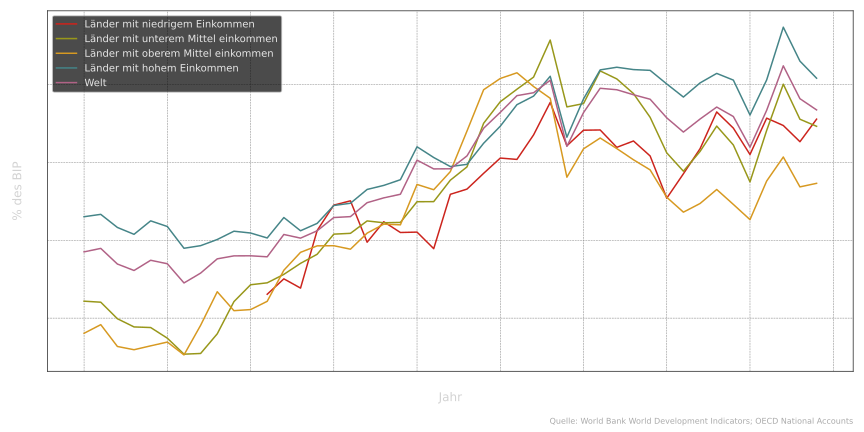{#fig:trade-share width=95%}

Parallel dazu fällt in @fig:poverty der Anteil der Bevölkerung in **extremer Armut**. Die internationale Armutsgrenze
liegt hier bei 2,15 US-Dollar pro Tag in Kaufkraftparitäten. Für die ärmsten Länder beginnen die Daten erst um 2002,
doch der langfristige Rückgang extremer Armut fällt zeitlich in eine Phase, in der viele Volkswirtschaften stärker in
den Welthandel integriert wurden.

Diese Beobachtung ist wichtig, aber sie ist noch kein Beweis. Armut sinkt nicht automatisch, nur weil Länder mehr
handeln. Institutionen, Bildung, Infrastruktur, politische Stabilität, Konflikte, Klima und Verteilungspolitik spielen
ebenfalls eine große Rolle. Dennoch gehört der Zugang zu größeren Märkten, zu Technologien, zu Importgütern und zu
Exporterlösen zu den wiederkehrenden Faktoren, die Produktivität und Lebensstandards beeinflussen [@wdi2025;
@rodrik2011]. Deshalb gehören die beiden Abbildungen zusammen: Sie zeigen nicht die fertige Antwort, sondern den
Ausgangspunkt unserer Analyse.

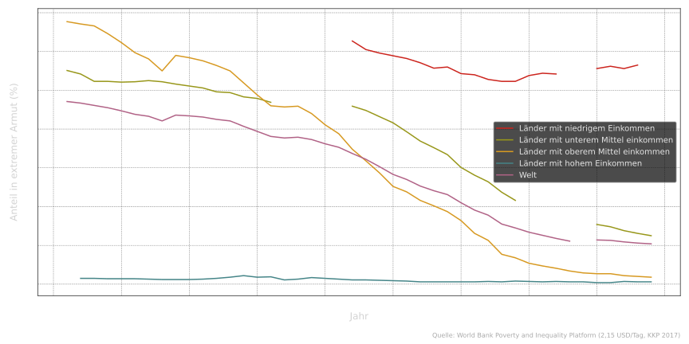{#fig:poverty width=95%}

Zwei Mechanismen stehen im Mittelpunkt des ersten Blocks. Erstens kann Handel die Versorgung robuster machen. Wenn eine
Ernte ausfällt, eine Fabrik stillsteht oder eine Region von einem Schock getroffen wird, können Importe Engpässe
abfedern. Zweitens kann Handel die Produktivität erhöhen, weil Länder sich auf Tätigkeiten spezialisieren, bei denen sie
relativ effizient sind.

Dieser zweite Mechanismus ist der klassische Kern der Handelstheorie. Um ihn zu verstehen, lohnt sich ein Blick zurück —
zu Adam Smith und David Ricardo.

## Von Smith und Ricardo zur Spezialisierung

Im 17. und 18. Jahrhundert prägte der Merkantilismus das handelspolitische Denken. Exporte galten als Quelle nationaler
Stärke, Goldreserven als Ausdruck politischer Macht, und Handel wurde häufig als Nullsummenspiel verstanden: Was ein
Land gewinnt, verliert ein anderes. Die Interessen der Verbraucherinnen und Verbraucher standen dabei selten im
Mittelpunkt.

Adam Smith widersprach dieser Sicht. Für ihn lag der Wohlstand einer Nation nicht in möglichst großen Goldbeständen,
sondern in der Fähigkeit, Güter effizient zu produzieren und zu konsumieren. Handel lohnt sich nach Smith, wenn Länder
dort produzieren, wo sie **absolute Kostenvorteile** haben — also mit gegebenen Ressourcen günstiger produzieren können
als andere [@smith1776].

David Ricardo machte das Argument 1817 noch radikaler. Handel kann sich sogar dann für beide Seiten lohnen, wenn ein
Land in allen Gütern absolut effizienter ist. Entscheidend sind nicht absolute Kosten, sondern **komparative
Kostenvorteile**: also die Frage, worauf ein Land verzichten muss, wenn es mehr von einem Gut produziert [@ricardo1817;
@krugman2018].

Ricardos berühmtes Beispiel handelt von Wein und Tuch in Portugal und England. @tbl:ricardo fasst eine vereinfachte
Version zusammen. Portugal benötigt für eine Tonne Wein 80 Arbeitsstunden und für eine Tonne Tuch 90 Arbeitsstunden.
England benötigt 120 Stunden für Wein und 100 Stunden für Tuch. Portugal ist also in beiden Gütern absolut produktiver.

Der entscheidende Punkt liegt in den relativen Kosten. Für Portugal kostet eine zusätzliche Tonne Wein 0,889 Tonnen
Tuch. Für England kostet sie 1,2 Tonnen Tuch. Wein ist für Portugal relativ günstiger; Tuch ist für England relativ
günstiger. Portugal sollte sich deshalb auf Wein spezialisieren, England auf Tuch — und beide können durch Tausch
gewinnen, obwohl Portugal in beiden Gütern absolut produktiver ist.

|          | Wein (h/t) | Tuch (h/t) | Tuch/Wein | Wein/Tuch |
| :------- | :--------: | :--------: | :-------: | :-------: |
| Portugal |     80     |     90     |   0,889   |   1,125   |
| England  |     120    |     100    |   1,200   |   0,833   |

: Ricardo-Beispiel: absolute und relative Produktionskosten {#tbl:ricardo}

Um den Wohlfahrtseffekt sichtbar zu machen, ergänzen wir das Beispiel um ein einfaches Arbeitsbudget. Portugal verfügt
über 170 Arbeitsstunden, England über 220. In Autarkie kann Portugal damit 1 Tonne Wein und 1 Tonne Tuch produzieren,
denn $80 + 90 = 170$. England kann ebenfalls 1 Tonne Wein und 1 Tonne Tuch produzieren, denn $120 + 100 = 220$. Ohne
Handel entstehen insgesamt also 2 Tonnen Wein und 2 Tonnen Tuch.

Bei Spezialisierung nach komparativen Kostenvorteilen produziert Portugal nur Wein und England nur Tuch. Portugal kann
mit 170 Arbeitsstunden $170/80 = 2{,}125$ Tonnen Wein herstellen; England kann mit 220 Arbeitsstunden $220/100 = 2{,}2$
Tonnen Tuch produzieren. Die Weltproduktion steigt damit von 2 auf 2,125 Tonnen Wein und von 2 auf 2,2 Tonnen Tuch —
ohne mehr Arbeit, ohne neue Maschinen und ohne technologischen Fortschritt. Genau darin liegt der statische
Wohlfahrtsgewinn des Ricardo-Modells: Handel schafft keinen Wohlstand aus dem Nichts, sondern erlaubt eine
Arbeitsteilung, bei der dieselben Ressourcen produktiver eingesetzt werden.

Das Modell ist bewusst einfach. Es blendet Transportkosten, Wechselkurse, Marktmacht, Skaleneffekte, Innovation,
politische Konflikte und Verteilungseffekte aus. Gerade deshalb ist es didaktisch so stark: Es isoliert den
Grundmechanismus. Spezialisierung kann die Gesamtproduktion erhöhen, selbst wenn die Welt nicht aus symmetrischen
Partnern besteht.

In der Realität sind die Gewinne aus Handel oft komplexer. Größere Märkte ermöglichen Skaleneffekte. Wettbewerb kann
Innovation beschleunigen. Unternehmen lernen durch Exportmärkte und ausländische Investoren. Technologietransfer kann
Produktivität erhöhen [@krugman2018]. Ricardos Modell zeigt also den statischen Kern. Die Entwicklungsgeschichte
moderner Schwellenländer zeigt, wie dieser Kern durch dynamische Effekte ergänzt wird.

Damit kommen wir nach Asien.

## Asien: Öffnung, Wachstum und Gegenbewegung

Südkorea, China und Indien stehen für unterschiedliche Wege in die Weltwirtschaft. Keines dieser Länder folgte einem
einfachen Rezept des „freien Marktes“. Aber alle drei nutzten internationale Märkte auf ihre Weise, um Wachstum,
Industrialisierung und technologischen Aufholprozess voranzutreiben.

@fig:trade-asia zeigt die Außenhandelsquote der drei Länder. Südkorea orientierte sich bereits ab den 1960er und 1970er
Jahren stark am Export. China öffnete sich ab Ende der 1970er Jahre schrittweise, politisch weiterhin stark gesteuert.
Indien liberalisierte Handel und Finanzmärkte besonders nach den Reformen der frühen 1990er Jahre [@ahluwalia2002;
@kochar2012].

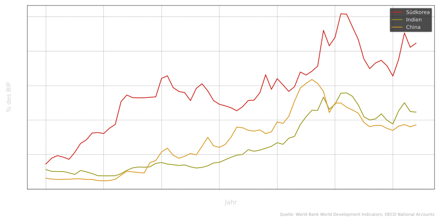{#fig:trade-asia width=95%}

@fig:gdp-asia zeigt für dieselben Länder das reale BIP pro Kopf als Index. Die Kurven erzählen keine identische
Geschichte, aber sie zeigen einen gemeinsamen Befund: Integration in die Weltwirtschaft und langfristiges Aufholwachstum
gingen in diesen Fällen Hand in Hand. Handel war dabei nicht die einzige Ursache. Industriepolitik, Bildung,
Infrastruktur, institutionelle Reformen und makroökonomische Stabilität waren ebenfalls entscheidend. Aber ohne Zugang
zu Exportmärkten, Kapitalgütern, Technologie und internationalen Lernprozessen wäre der Aufholprozess schwerer
vorstellbar.

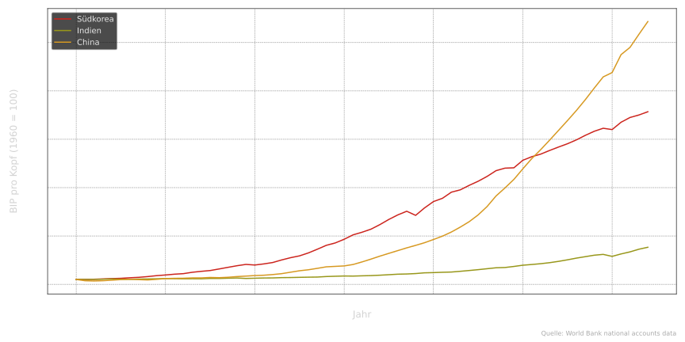{#fig:gdp-asia width=95%}

Gerade diese Beispiele zeigen aber auch, warum die einfache Gleichung „mehr Handel = mehr Wohlstand“ zu kurz greift.
Seit Mitte der 2000er Jahre steigt die Außenhandelsquote nicht mehr überall weiter. Das hat mehrere Gründe. Eine Quote
kann nicht unbegrenzt wachsen. Globale Wertschöpfungsketten haben sich teilweise ausgereift. Nach der Finanzkrise nahm
die Skepsis gegenüber globalen Märkten zu. Niedrige globale Zinsen erzeugten in manchen Schwellenländern
Aufwertungsdruck und finanzielle Instabilität. Gleichzeitig gewannen Protektionismus und industriepolitische
Schutzmaßnahmen wieder an Bedeutung [@rodrik2011; @autor2016china].

Damit verschiebt sich unsere Frage. Wenn Handel in der Theorie und in vielen historischen Fällen Wohlstand schafft:
Warum handeln Länder dann nicht einfach immer frei?

## Warum handeln Länder nicht „einfach immer frei“?

Ricardos Modell zeigt, warum Handel die Gesamtproduktion erhöhen kann. Es sagt aber wenig darüber, wer innerhalb eines
Landes gewinnt und wer verliert. Genau dort beginnt die Politik.

Wenn ein Land sich öffnet, profitieren häufig Verbraucherinnen und Verbraucher durch niedrigere Preise.
Exportorientierte Unternehmen gewinnen neue Märkte. Produktive Firmen können wachsen. Gleichzeitig geraten geschützte
Branchen unter Druck. Beschäftigte in importkonkurrierenden Sektoren verlieren möglicherweise Einkommen, Status oder
Arbeitsplätze. Der gesamtwirtschaftliche Gewinn aus Handel kann also real sein — und trotzdem können einzelne Gruppen
reale Verluste erleiden.

Hinzu kommen strategische Fragen. Energie, Halbleiter, Pharmazeutika, Nahrungsmittel oder Rüstungsgüter werden selten
wie beliebige Standardprodukte behandelt. Wer bei kritischen Gütern stark von politischen Rivalen abhängig ist, erlebt
Handel nicht nur als Effizienzgewinn, sondern auch als Risiko. Zölle, Exportkontrollen, Sanktionen, Klima- und
Arbeitsstandards oder industriepolitische Subventionen sind deshalb nicht bloß Abweichungen von der Theorie. Sie sind
Ausdruck der Tatsache, dass Handel immer auch Macht, Sicherheit und Verteilung berührt [@rodrik2011;
@imf2023fragmentation].

@fig:epu-trade zeigt den **Economic Policy Uncertainty Index** für Handelspolitik. Er misst, wie häufig US-Zeitungen
über Zölle, Handelskonflikte und Handelsabkommen berichten [@baker2016; @fred2025]. Die monatliche Kurve liegt lange auf
moderatem Niveau, steigt aber in den Jahren 2018 und 2019 deutlich an — während des Handelskonflikts zwischen den USA
und China. Ab 2025 nimmt die Unsicherheit im Kontext der zweiten Trump-Administration erneut zu [@piie2025tariffs].

Wichtig ist die Interpretation: Der Index misst Unsicherheit und mediale Aufmerksamkeit, nicht den durchschnittlichen
Zollsatz. Aber gerade Unsicherheit ist ökonomisch relevant. Unternehmen investieren weniger, wenn sie nicht wissen, ob
Lieferketten, Zölle oder Absatzmärkte morgen noch stabil sind. Der erste Block endet damit an einem Punkt, an dem sich
Theorie und Politik treffen: Handel kann Produktivität steigern, aber seine institutionellen und geopolitischen
Voraussetzungen sind fragil.

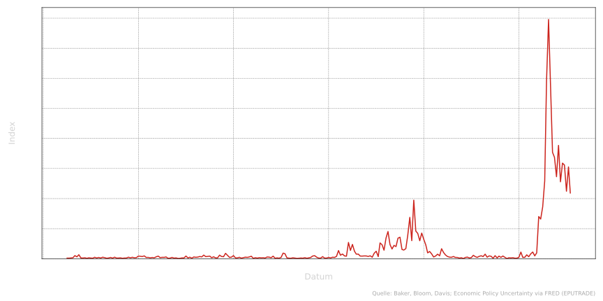{#fig:epu-trade width=95%}

Diese Fragilität führt uns zum zweiten Block. Denn die Weltwirtschaft besteht nicht nur aus Güterströmen. Kapital bewegt
sich oft schneller als Waren — und reagiert noch sensibler auf Erwartungen, Zinsen und politische Unsicherheit.

# Finanzmärkte und wirtschaftliche Entwicklung

## Kapitalströme und die Realwirtschaft

Im ersten Teil standen Gütermärkte im Mittelpunkt. Jetzt geht es um internationale **Finanzströme**. Auch sie können
Entwicklung ermöglichen. Ein Land mit guten Investitionsmöglichkeiten, aber niedrigen heimischen Ersparnissen, kann
durch ausländisches Kapital mehr investieren, als es allein finanzieren könnte. Straßen, Fabriken, Stromnetze,
Maschinen, Software und Ausbildung müssen bezahlt werden, bevor sie Produktivität erzeugen.

Die zentrale Frage lautet daher: Wann helfen globale Finanzmärkte, produktive Investitionen zu finanzieren — und wann
verwandeln sie sich in eine Quelle makroökonomischer Instabilität? [@krugman2018; @eichengreen2008]

@fig:capital-market-1 zeigt ein schematisches **Kapitalmarktdiagramm**. Auf der vertikalen Achse steht der Zins $i$, auf
der horizontalen Achse Ersparnis $S$ und Investition $I$. Die Ersparnisfunktion $S(i)$ steigt mit dem Zins: Höhere
Verzinsung macht Sparen attraktiver. Die Investitionsfunktion $I(i)$ fällt: Je höher die Finanzierungskosten, desto
weniger Projekte lohnen sich. In einer geschlossenen Volkswirtschaft schneiden sich beide Kurven im Punkt $(I^\ast,
i^\ast)$; dort gilt $I^\ast = S^\ast$.

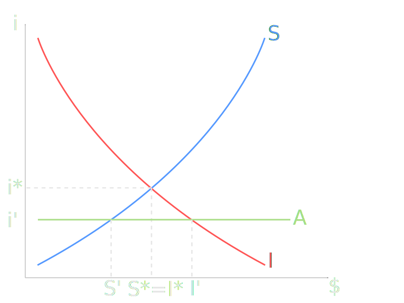{#fig:capital-market-1 width=75%}

Die horizontale Linie $A$ steht für den Zugang zum internationalen Kapitalmarkt zu einem Zins $i' < i^\ast$. Öffnet sich
das Land für Kapitalzuflüsse, können Unternehmen und Staat günstiger investieren. Die Investitionsnachfrage steigt über
die inländischen Ersparnisse hinaus: $I > S$. Die Differenz wird durch Kapital aus dem Ausland finanziert.

Makroökonomisch hat das eine klare Entsprechung: Ein Land mit Kapitalzuflüssen weist typischerweise ein
Leistungsbilanzdefizit auf. Es importiert netto Kapital und kann damit mehr investieren oder konsumieren, als es aus
laufendem Einkommen finanziert. Umgekehrt exportiert ein Land mit hohen Ersparnissen und relativ wenigen rentablen
Investitionsmöglichkeiten Kapital ins Ausland. Leistungsbilanz und Kapitalbilanz sind damit zwei Seiten derselben
Medaille.

@fig:ca-balances macht diesen Zusammenhang global sichtbar. Die Treemap zeigt **Leistungsbilanzsaldi** vieler Länder für
ein Jahr: grüne Flächen für Überschüsse, rote für Defizite, die Flächengröße nach Betrag. In der Theorie sollte die
Summe aller Länder nahe null liegen; statistische Messfehler erklären Abweichungen. Auffällig sind persistente
Überschüsse einzelner Volkswirtschaften, etwa Deutschlands oder Chinas in bestimmten Phasen. Sie können auf hohe
Ersparnisse, schwache Binneninvestitionen, Währungsinterventionen oder begrenzte Binnenabsorption hinweisen [@wdi2025;
@imfsta2025].

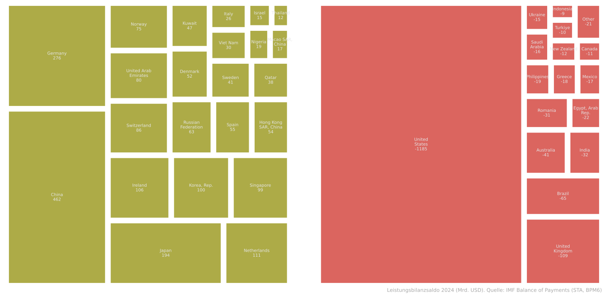{#fig:ca-balances width=95%}

Kapitalströme sind also nicht abstrakt. Sie verbinden Sparer in einem Teil der Welt mit Investitionsprojekten in einem
anderen. Die Entwicklungsfrage lautet: Wird daraus produktiver Strukturwandel? Indien liefert dafür ein wichtiges
Beispiel.

## Indien: Reformen, Direktinvestitionen und Strukturwandel

Indien verbindet die Handels- und Finanzgeschichte dieser Vorlesung. Bis in die 1980er Jahre war die indische Wirtschaft
stark reguliert und nach außen abgeschottet. Diese Politik hatte historische Gründe, darunter die Erfahrung kolonialer
Abhängigkeit und der Wunsch nach wirtschaftlicher Souveränität [@ahluwalia2002].

1991 geriet Indien in eine Zahlungsbilanzkrise. Die Devisenreserven reichten nur noch für wenige Wochen
Importfinanzierung. Diese Krise wurde zum Wendepunkt. Indien senkte Zölle und Quoten, liberalisierte Teile des
Bankensektors, öffnete sich stärker für ausländisches Kapital und baute viele Elemente des alten Lizenzsystems ab.

@fig:india-fdi zeigt **ausländische Direktinvestitionen** als Anteil am BIP. In den 1980er Jahren liegt die Kurve nahe
null. Nach 1991 steigt sie fast durchgehend. Direktinvestitionen sind langfristiger angelegt als kurzfristige
Portfolioflüsse: Unternehmen beteiligen sich an Firmen, bauen Produktionsstätten auf, investieren in Infrastruktur oder
Dienstleistungen [@unctad2025]. Der Ausschlag um 2009 dominiert die Skala, aber die eigentliche Entwicklungsgeschichte
liegt im graduellen Anstieg der 1990er und 2000er Jahre.

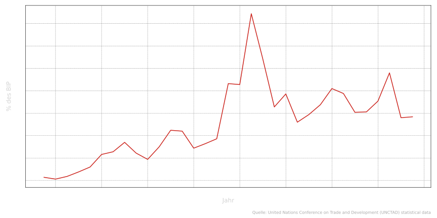{#fig:india-fdi width=95%}

@fig:india-catchup zeigt das **Pro-Kopf-Einkommen** Indiens relativ zu den USA. In den 1980er Jahren vergrößert sich die
Lücke. Nach den Reformen beginnt ein Aufholprozess. Das ist besonders bemerkenswert, weil es sich um Pro-Kopf-Größen
handelt: Wachstum musste also stark genug sein, um nicht nur die Gesamtwirtschaft, sondern auch das Einkommen pro
Einwohnerin und Einwohner zu erhöhen.

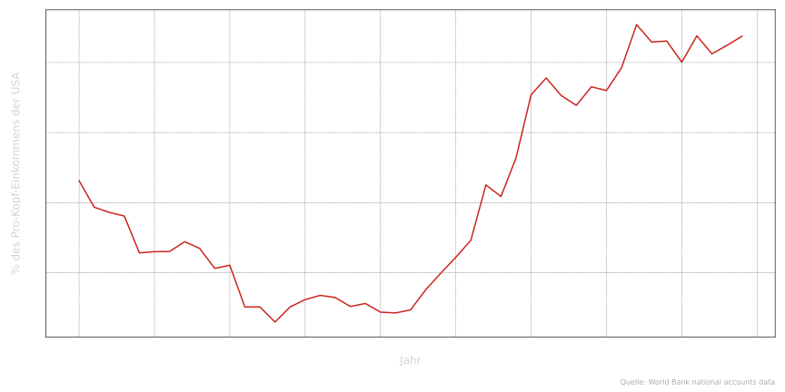{#fig:india-catchup width=95%}

Entwicklung ist jedoch nicht nur eine Frage der Menge an Kapital, sondern auch der Art wirtschaftlicher Aktivität.
@fig:india-tech zeigt den Anteil mittel- und hochtechnologischer Exporte an den Industrieexporten. Die Linie steigt seit
den frühen 1990er Jahren nahezu kontinuierlich. Das deutet auf eine qualitative Veränderung hin: Indien exportierte
nicht nur mehr, sondern zunehmend komplexere Güter und Dienstleistungen.

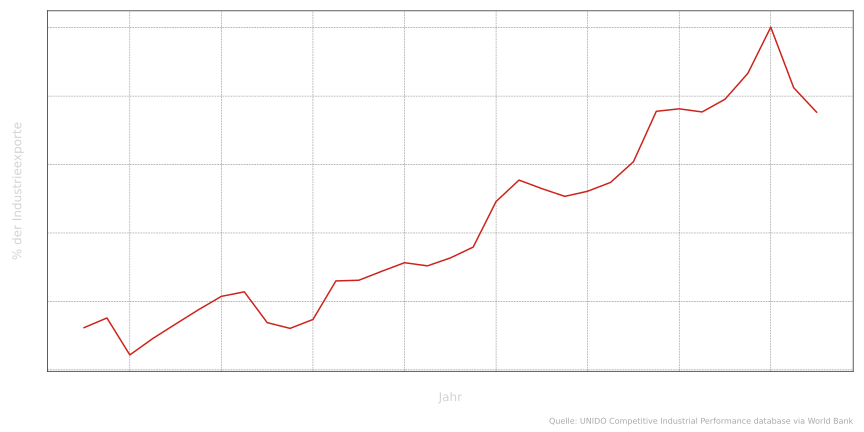{#fig:india-tech width=95%}

Mehrere Kanäle können diesen Strukturwandel erklären. Ausländische Direktinvestitionen bringen Kapital, Managementwissen
und Technologie. Exportmärkte setzen Unternehmen stärkerem Wettbewerb aus. Reformen im Finanzsektor verbessern den
Zugang heimischer Firmen und Haushalte zum formalen Bankensystem [@kochar2012]. Der zweite Block endet damit auf einer
vorsichtig optimistischen Note: Finanzielle Integration kann Entwicklung unterstützen, wenn sie langfristige
Investitionen und Strukturwandel ermöglicht.

Doch diese Optimismus hat eine Grenze. Kapital kann nicht nur kommen. Es kann auch gehen — manchmal sehr plötzlich.

# Wechselkurse, Währungspolitik und Finanzkrisen

## Von Kapitalzuflüssen zur Krise: Thailand

Wenn Globalisierung Wachstum und Armutsreduktion fördern kann, warum ist sie dann politisch so umkämpft? Eine Antwort
lautet: Weil Integration nicht nur Chancen verteilt, sondern auch Risiken beschleunigt.

Globale Finanzmärkte können lokale Schocks abfedern. Sie ermöglichen Ländern mit geringen Ersparnissen Investitionen,
die sonst nicht finanzierbar wären. Gleichzeitig schaffen sie neue Verwundbarkeiten: plötzliche Kapitalumkehr,
Wechselkursstress, Verschuldung in Fremdwährung und Krisen, die sich durch Erwartungen selbst verstärken können
[@eichengreen2008; @fischer1998]. Thailand in den 1990er Jahren ist ein Lehrstück für diese Dynamik.

@fig:thailand-ca zeigt den **Leistungsbilanzsaldo** Thailands in Millionen US-Dollar. Vor 1997 liegt die Kurve
überwiegend im negativen Bereich. Thailand importierte netto Kapital. Ausländische Mittel finanzierten Investitionen,
Immobilienprojekte, Kreditexpansion und Konsum. Solange Kapitalzuflüsse anhielten, wirkte dieses Modell stabil.

Mit der Krise kehrt sich das Muster abrupt um. Aus Defiziten werden Überschüsse. Das klingt zunächst positiv, ist es
aber in diesem Kontext nicht. Der Überschuss entsteht nicht aus einem ruhigen Exportboom, sondern aus Kapitalabzug,
Importkompression, Rezession und einem abrupten Ende der Finanzierung [@imfsta2025; @corsetti1999]. Die Grafik ist der
empirische Einstieg in eine allgemeine Mechanik: Ein Land, das lange Kapital importiert, kann in Schwierigkeiten
geraten, wenn ausländische Investoren plötzlich höhere Risikoprämien verlangen oder ihr Kapital abziehen.

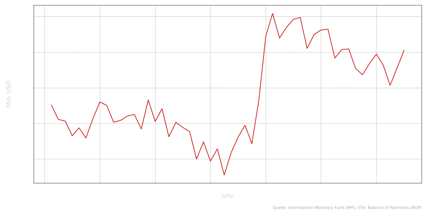{#fig:thailand-ca width=95%}

@fig:capital-market-2 übersetzt diese Geschichte in ein Kapitalmarktdiagramm. Die Ausgangslage ist wie zuvor: Bei Zugang
zu günstigem ausländischem Kapital gilt $I > S$. Das Land finanziert die Differenz durch Kapitalzuflüsse. Wenn aber der
Zins für ausländisches Kapital steigt — etwa durch höhere US-Zinsen, politische Unsicherheit, Zweifel an Banken oder
eine veränderte Risikowahrnehmung —, verändert sich die Rechnung. Projekte, die bei niedrigen Finanzierungskosten
rentabel wirkten, erscheinen plötzlich riskant oder unrentabel. Kapital wird abgezogen. Kurzfristig kann $S > I$ gelten.

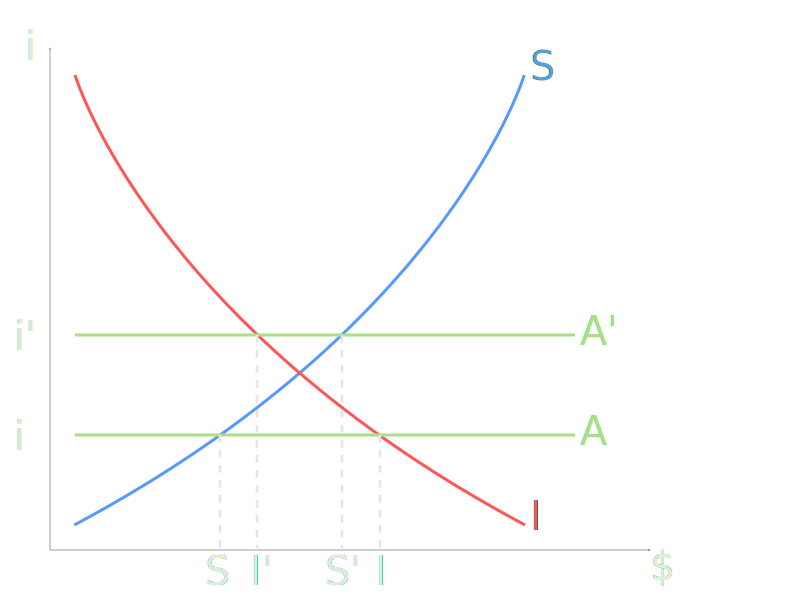{#fig:capital-market-2 width=75%}

In der Realität verschieben sich dabei nicht nur Linien in einem Diagramm. Erwartungen ändern sich, Kreditbedingungen
verschärfen sich, Banken geraten unter Druck, Unternehmen stoppen Investitionen, und der Wechselkurs wird zum
Krisenverstärker [@corsetti1999; @fischer1998]. Besonders gefährlich ist Kapital, das kurzfristig finanziert und in
Fremdwährung verschuldet ist. Genau deshalb führt der nächste Schritt zu Wechselkursen und Auslandsverschuldung.

## Wechselkurse und Verschuldung

Der **nominale Wechselkurs** gibt an, wie viele Einheiten der Inlandswährung für eine Einheit Auslandswährung gezahlt
werden müssen. Steigt diese Zahl, wertet die Inlandswährung ab. Fällt sie, wertet sie auf.

Eine **Aufwertung** macht Importe günstiger und Exporte teurer. Für exportorientierte Schwellenländer kann das
problematisch sein, weil Wettbewerbsfähigkeit und Beschäftigung im Exportsektor unter Druck geraten. Eine **Abwertung**
wirkt zunächst anders: Exporte werden günstiger, was Wachstum stützen kann. Gleichzeitig verteuern sich Importe. Das
kann Inflation auslösen — besonders wenn Energie, Nahrungsmittel oder Vorprodukte importiert werden. Noch gefährlicher
wird eine Abwertung, wenn Unternehmen, Banken oder Staat in Fremdwährung verschuldet sind [@krugman2018;
@eichengreen2008].

@fig:thailand-debt zeigt Thailands **Auslandsverschuldung** in zwei Maßeinheiten: in US-Dollar und umgerechnet in Thai
Baht. In US-Dollar bewegt sich die Verschuldung relativ glatt. Aus Sicht inländischer Schuldner zählt aber die
Baht-Last. Als der Baht in der Krise einbrach, stieg der lokale Wert der Dollarschulden sprunghaft. Innerhalb eines
Jahres konnte die in Baht gemessene Schuldenlast um fast 60 Prozent steigen [@imfsta2025; @fischer1998].

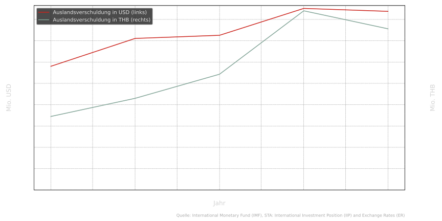{#fig:thailand-debt width=95%}

Das ist der Kern vieler Schwellenländerkrisen: Eine Abwertung hilft theoretisch den Exporten, verschlechtert aber
gleichzeitig die Bilanzen derjenigen, die in Fremdwährung verschuldet sind. Unternehmen, die vorher solvent wirkten,
können plötzlich zahlungsunfähig werden. Banken, die diese Unternehmen finanziert haben, geraten ebenfalls unter Druck.
Aus einem Wechselkursproblem wird ein Bankenproblem — und aus einem Bankenproblem eine Rezession.

Damit stellt sich die naheliegende Frage: Kann eine Zentralbank den Wechselkurs stabilisieren?

## Währungspolitik und ihre Grenzen

Zentralbanken können Wechselkurse beeinflussen, aber sie können sie nicht beliebig kontrollieren. Bei
**Aufwertungsdruck** kaufen sie Devisen und geben eigene Währung aus. Dadurch steigt die Nachfrage nach ausländischer
Währung, und die eigene Währung wird tendenziell geschwächt. Gleichzeitig kann die heimische Geldmenge wachsen, was
Kreditboom und Inflation begünstigen kann.

Bei **Abwertungsdruck** geschieht das Gegenteil. Die Zentralbank verkauft Devisenreserven und kauft die eigene Währung,
um sie zu stützen. Das funktioniert nur so lange, wie genügend Reserven vorhanden sind und die Märkte glauben, dass die
Zentralbank den Kurs verteidigen kann [@eichengreen2008; @fischer1998]. Sobald Zweifel entstehen, kann die Verteidigung
des Wechselkurses selbst zum Signal der Schwäche werden: Wenn Reserven schnell fallen, steigt die Erwartung einer
Abwertung — und genau diese Erwartung erhöht den Druck weiter.

@fig:thailand-forex verbindet **Währungsreserven** und den **Baht-Kurs**. In der ersten Hälfte der 1990er Jahre steigen
die Reserven. Das passt zu einer Phase starker Kapitalzuflüsse und Interventionen zur Stabilisierung des Wechselkurses.
Nach 1997 brechen die Reserven ein, während die Währung stark fällt [@imfsta2025]. Die Grafik zeigt die Grenze der
Intervention: Eine Zentralbank kann Zeit kaufen, aber sie kann fundamentale Zweifel an Tragfähigkeit, Verschuldung und
Kapitalflüssen nicht dauerhaft wegintervenieren.

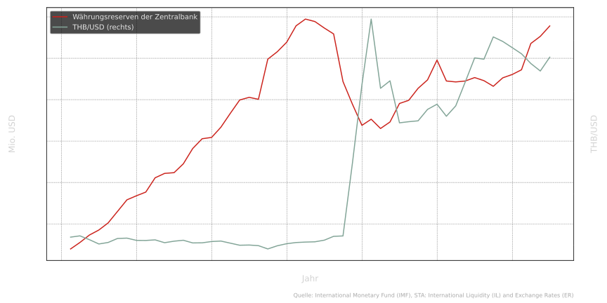{#fig:thailand-forex width=95%}

Die entscheidende Frage ist nun, ob solche Krisen „nur“ Finanzmärkte betreffen. @fig:thailand-gdp zeigt, dass die
Antwort nein lautet. Das **Pro-Kopf-Einkommen** Thailands in aktuellen US-Dollar bricht um 1997/98 stark ein — um rund
40 Prozent — und erholt sich danach nur langsam.

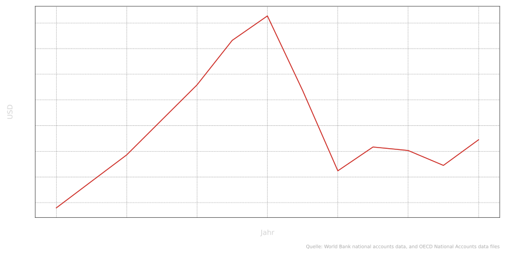{#fig:thailand-gdp width=95%}

Der Übertragungsmechanismus ist direkt. Unternehmen mit Dollarschulden konnten ihre Verbindlichkeiten nicht mehr
bedienen. Banken mussten Kredite abschreiben. Investitionsprojekte wurden gestoppt. Arbeitsplätze gingen verloren. Aus
einer Finanzkrise wurde eine reale Wirtschaftskrise [@corsetti1999; @fischer1998].

Damit schließt der dritte Block mit einer wichtigen Einsicht: Finanzielle Globalisierung kann Entwicklung beschleunigen,
aber sie macht Volkswirtschaften verletzlich, wenn Kapitalzuflüsse kurzfristig sind, Verschuldung in Fremdwährung
aufgenommen wird und Wechselkursregime nicht glaubwürdig abgesichert sind.

Im letzten Block weiten wir den Blick. Die Fragilität globaler Integration betrifft heute nicht nur Kapitalmärkte,
sondern auch Lieferketten, Energie, Klima und Rohstoffe.

# Versorgungssicherheit in einer fragmentierten Weltwirtschaft

## Ein neues Regime für globale Lieferketten

Globalisierung hat Milliarden Menschen aus extremer Armut geholfen und bleibt ein wichtiger Hebel für internationale
Kooperation — etwa bei Klimaschutz, Technologietransfer und Versorgung mit kritischen Gütern [@ipcc2023; @rodrik2011].
Aber die letzten Jahre haben gezeigt, dass globale Vernetzung nicht nur Effizienz erzeugt. Sie kann auch Verwundbarkeit
sichtbar machen.

Die COVID-19-Pandemie war dafür ein Wendepunkt. Unternehmen und Politik erkannten, wie abhängig moderne
Produktionssysteme von reibungslosen Lieferketten sind: von Häfen, Containern, Vorprodukten, Energie, Halbleitern,
Logistiksoftware und politischen Entscheidungen in weit entfernten Regionen [@baldwin2022; @economist2021supplychains].

@fig:shipping zeigt einen US-Erzeugerpreisindex für **Hochseefracht**, indexiert auf 2019 = 100 [@fred2025]. Anfang 2020
fällt die Kurve zunächst mit dem Nachfrageeinbruch der Lockdowns. Danach folgt 2021 ein steiler Anstieg: Güternachfrage,
Hafenstaus, Containerknappheit und Kapazitätsengpässe treiben die Kosten. 2022 verstärken Energiepreise und
geopolitische Unsicherheit den Druck. Seitdem normalisieren sich die Raten teilweise, bleiben aber über dem
Vorkrisenniveau [@giovanni2022; @imf2023fragmentation].

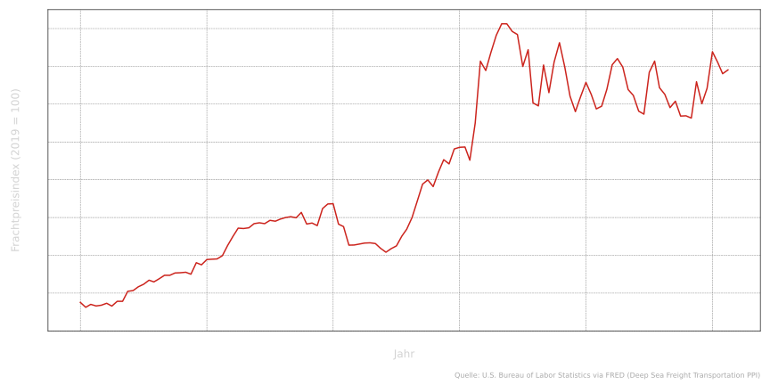{#fig:shipping width=95%}

Die Grafik zeigt mehr als einen kurzen Pandemieeffekt. Sie steht für ein neues Regime höherer Aufmerksamkeit für
Lieferkettenrisiken. Jahrzehntelang dominierte die Logik der Effizienz: niedrige Lagerbestände, Just-in-time-Produktion,
globale Spezialisierung. Diese Logik bleibt ökonomisch attraktiv. Aber sie wird heute stärker durch Resilienzfragen
ergänzt: Wie viele Reserven brauchen Unternehmen? Wie viele Lieferanten? Wie viel Produktion sollte regional abgesichert
sein? Und was kostet diese Sicherheit?

Diese Fragen führen direkt zu geopolitischen Engpässen.

## Geopolitische Engpässe: Suez und Hormus

Globale Lieferketten sind nicht nur ökonomische Netzwerke. Sie haben geografische Knotenpunkte. Einige davon sind so
wichtig, dass Störungen an einem Ort globale Folgen haben können.

@fig:suez zeigt das geschätzte **Transitvolumen** durch den Suezkanal als 28-Tage-gleitender Durchschnitt, indexiert auf
den Durchschnitt 2019–2023. Ab Ende 2023 fällt die Kurve deutlich. Das bedeutet nicht, dass der Welthandel im gleichen
Ausmaß schrumpft. Es bedeutet, dass ein wichtiger Korridor gemieden wird. Der Suezkanal ist Teil der Route durch das
Rote Meer und die Straße Bab al-Mandab. Angriffe auf Handelsschiffe und militärische Eskalation führten dazu, dass viele
Reedereien um das Kap der Guten Hoffnung ausweichen mussten [@imfportwatch2025; @ft2024suez].

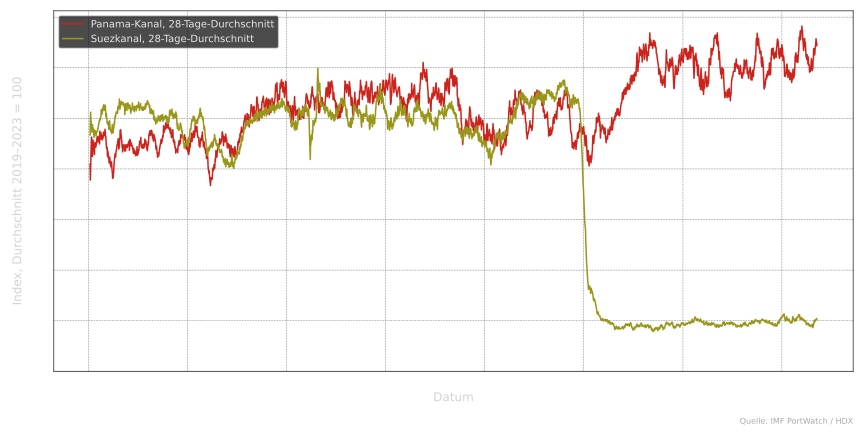{#fig:suez width=95%}

Die ökonomischen Folgen entstehen nicht nur durch den Ausfall eines Kanals. Längere Routen bedeuten höhere
Treibstoffkosten, längere Lieferzeiten, höhere Versicherungskosten und weniger verfügbare Schiffskapazität. Damit
verbindet sich @fig:suez unmittelbar mit @fig:shipping: Engpässe an einer Stelle können Kosten und Planbarkeit im
gesamten Netz verändern.

Die **Straße von Hormus** ist ein zweiter zentraler Engpass, besonders für Öl und Gas. @fig:hormuz zeigt das geschätzte
Transitvolumen 2025–2026 als 7-Tage-gleitender Durchschnitt, indexiert auf 2025 = 100. In akuten Krisenphasen sinkt der
Transit stärker als das globale Handelsvolumen, weil Schiffe Routen meiden, verzögert fahren oder Lieferungen aus
Lagerbeständen ersetzt werden [@imfportwatch2025; @reuters2026hormuz].

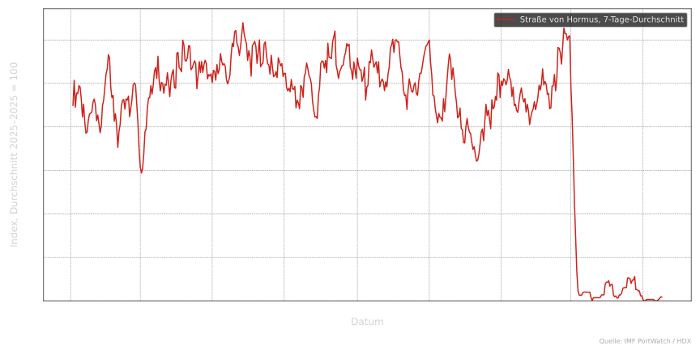{#fig:hormuz width=95%}

Öl ist ein global gehandelter Rohstoff. Risiken an Hormus wirken deshalb nicht nur regional, sondern auf
Weltmarktpreise. @fig:oil-2026 zeigt Brent- und WTI-Spotpreise ab Mitte 2025. Die vertikale Markierung kennzeichnet den
Beginn der akuten Hormus-/Iran-Krise Ende Februar 2026. Danach steigen die Preise deutlich [@fred2025;
@reuters2026hormuz].

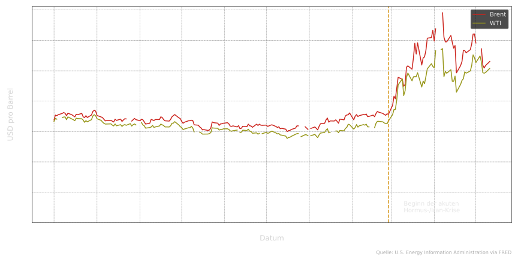{#fig:oil-2026 width=95%}

Damit wird ein bekanntes Muster sichtbar: Ein lokales Risiko kann globale makroökonomische Folgen haben. Höhere
Energiepreise erhöhen Transportkosten, treiben Inflation, verschlechtern die Leistungsbilanz energieimportierender
Länder und können geldpolitische Reaktionen auslösen. Die Themen des zweiten und dritten Blocks — Leistungsbilanz,
Kapitalmärkte, Wechselkurse und Krisen — kehren hier in anderer Form zurück.

## Klimawandel, Emissionen und die Energiewende

Die größte langfristige Herausforderung globaler Wirtschaftsbeziehungen ist der Klimawandel. Er ist nicht nur ein
Umweltproblem, sondern ein ökonomisches Koordinationsproblem: Emissionen entstehen weltweit, Schäden sind ungleich
verteilt, und technologische Lösungen hängen selbst von Handel, Investitionen und Rohstoffen ab.

@fig:co2-total zeigt die weltweiten **CO~2~-Emissionen** ohne Landnutzungsänderung in Gigatonnen [@wdi2025; @ipcc2023].
Trotz Effizienzgewinnen in vielen Volkswirtschaften steigen die Gesamtemissionen langfristig mit Wirtschaftsaktivität
und Energieverbrauch. Der pandemiebedingte Rückgang 2020 ist sichtbar, aber nur vorübergehend.

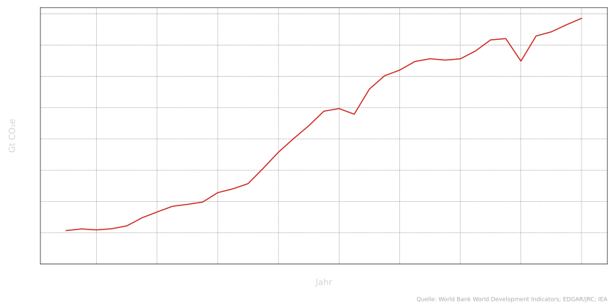{#fig:co2-total width=95%}

@fig:co2-intensity ergänzt diese Perspektive. Sie zeigt **Emissionen pro Kopf** und die **CO~2~-Intensität des BIP**,
also Emissionen pro Dollar Wertschöpfung in Kaufkraftparitäten. Die Intensität sinkt langsam. Pro Dollar
Wirtschaftsleistung wird also weniger CO~2~ ausgestoßen. Gleichzeitig können die Gesamtemissionen weiter steigen, wenn
die Weltwirtschaft schneller wächst als die Emissionsintensität sinkt [@ipcc2023; @dechezlepretre2023].

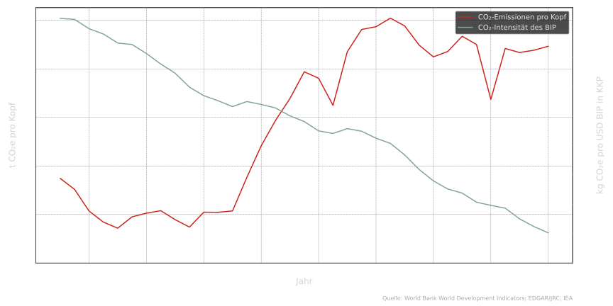{#fig:co2-intensity width=95%}

Diese beiden Abbildungen zeigen die zentrale Spannung: Nachhaltiges Wachstum ist möglich, aber nicht automatisch. Es
reicht nicht, dass Produktion effizienter wird. Die Entkopplung muss stark genug sein, um absolute Emissionen zu senken.

Der Klimawandel wirkt zugleich auf die Weltwirtschaft zurück. Wetterextreme belasten Infrastruktur, Landwirtschaft,
Energieversorgung und Transportwege. Niedrige Wasserstände können Kanäle einschränken, Hitze kann Arbeitsproduktivität
senken, Dürren können Nahrungsmittelpreise erhöhen [@ipcc2023]. Versorgungssicherheit wird dadurch nicht weniger,
sondern stärker mit Klimapolitik verknüpft.

Die **Energiewende** verschiebt dabei Abhängigkeiten. Kohle, Öl und Gas verlieren langfristig an Bedeutung, aber neue
Rohstoffe werden wichtiger: Lithium, Kobalt, Kupfer und seltene Erden. @fig:commodities zeigt Preisindizes für
klassische und kritische Rohstoffe, indexiert auf Juni 2012 = 100 [@imfcommodities2025; @iea2024critical; @usgs2024]. Öl
und Kohle bleiben volatil, etwa im Zusammenhang mit dem Ukraine-Krieg. Lithium und seltene Erden schwanken ebenfalls
stark und sind geografisch konzentriert; ein erheblicher Anteil der Verarbeitung liegt in China [@iea2024critical].

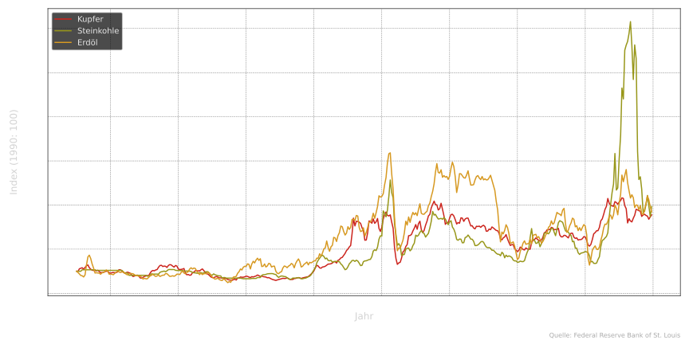{#fig:commodities width=95%}

Damit schließt sich der Bogen zur Handelspolitik. Auch grüne Technologien beseitigen Abhängigkeiten nicht automatisch.
Sie verändern sie. Die Frage ist daher nicht, ob eine moderne Wirtschaft abhängig ist, sondern welche Abhängigkeiten sie
eingeht, wie diversifiziert sie sind und wie politisch riskant sie werden können.

## Versorgungssicherheit unter Fragmentierung: Leitfragen

Am Ende der Vorlesung stehen keine Patentlösungen. Stattdessen verdichten sich mehrere Zielkonflikte, die internationale
Wirtschaftsbeziehungen in den kommenden Jahren prägen werden.

**Effizienz und Resilienz.** Just-in-time-Lieferketten reduzieren Lagerkosten und erhöhen Produktivität. Resilienz
verlangt dagegen Redundanz, Vorräte, mehrere Bezugsquellen oder regionale Produktion. Diese Sicherheit ist nicht
kostenlos. Güter können teurer werden, Unternehmen verlieren Skalenvorteile, und politische Konflikte verschieben sich
[@baldwin2022; @giovanni2022]. Der Konflikt ist derselbe, der schon bei Ricardo angelegt war: Spezialisierung steigert
Effizienz, aber sie erzeugt Abhängigkeit.

**Handelspolitik.** Zölle und Unsicherheit können heimische Industrien schützen, aber sie verteuern Importe, schwächen
Wettbewerb und provozieren Gegenmaßnahmen [@piie2025tariffs; @wto2024]. Friend-shoring reduziert Abhängigkeiten von
politischen Rivalen, kann aber neue Konzentrationsrisiken schaffen, wenn zu viele Lieferketten auf eine kleine Gruppe
politisch vertrauter Länder verlagert werden [@imf2023fragmentation].

**Energie und Engpässe.** Lokale Routenrisiken wie Suez und Hormus können globale Preis- und Inflationswirkungen
auslösen. Energiepreise beeinflussen Leistungsbilanzen, Wechselkurse, Staatshaushalte und Geldpolitik. Damit sind
Lieferkettenfragen zugleich makroökonomische Fragen.

**Klima und Rohstoffe.** Die Weltwirtschaft wird pro Dollar Wertschöpfung emissionsärmer, aber das genügt nicht, solange
absolute Emissionen hoch bleiben. Die Energiewende braucht Handel und Investitionen, erzeugt aber neue
Rohstoffabhängigkeiten. Klimaschutz, Versorgungssicherheit und Entwicklungspolitik lassen sich deshalb nicht getrennt
denken.

**Rolle von Handel und Finanzmärkten.** Mehr Handel kann Diversifikation erhöhen und regionale Schocks abfedern. Weniger
Handel kann bestimmte Abhängigkeiten reduzieren, aber zugleich Kosten erhöhen und ärmere Länder von Entwicklungswegen
abschneiden. Finanzmärkte können Risiken verteilen — etwa über Versicherungen, Derivate oder Katastrophenanleihen —, sie
können aber auch prozyklische Bewegungen verstärken, wie die Thailand-Folge gezeigt hat [@krugman2018;
@eichengreen2008].

Die Schlussfolgerung ist ambivalent, aber nicht beliebig. Globalisierung bleibt ein Entwicklungsmotor. Sie kann Märkte
öffnen, Wissen verbreiten, Kapital mobilisieren und Armut reduzieren. Gleichzeitig verlangt eine Welt aus geopolitischer
Rivalität, Klimarisiken und fragilen Lieferketten eine neue Balance: zwischen Effizienz und Resilienz, Offenheit und
strategischer Autonomie, Wettbewerb und Kooperation [@rodrik2011; @imf2023fragmentation].

Die entscheidende Frage für die Zukunft lautet daher nicht, ob die Weltwirtschaft offen oder geschlossen sein sollte.
Sie lautet: Wie gestalten wir internationale Wirtschaftsbeziehungen so, dass sie Wohlstand schaffen, ohne Verwundbarkeit
zu ignorieren?

# Anhang: Leistungsnachweis

Studierende verfassen ein Essay von 1000 bis 1200 Wörtern. Die Arbeit wird einzeln verfasst; Plagiate sind
ausgeschlossen. Quellen müssen kenntlich gemacht werden, insbesondere bei Daten. Wissenschaftliche Zeitschriften sind
ausdrücklich erwünscht. Für aktuelle Themen sind auch Zeitungs- und Policy-Quellen zulässig, sofern sie sorgfältig
eingeordnet werden. Die Abgabe erfolgt bis zum 14.07.2026 über Moodle.

Die Themenvorschläge knüpfen an die Leitfragen der Vorlesung an: US-Zölle seit 2025; Lieferketten nach COVID-19;
Friend-shoring; Suez, Hormus und Energiemärkte; Klimawandel und CO~2~-Entkopplung; Energiewende und Rohstoffe; Thailand
1997; der Ressourcenfluch [@sachs1995resource]. Eigene Themen sind nach Rücksprache möglich.
