<!-- .slide: data-background-image="images/container-port.jpg" -->
# Internationale Wirtschaftsbeziehungen
## David Joshua Cardoso Herok
### Hochschule Anhalt

---

# Zeitplan

|                 |                                                |
|:---------------:|:-----------------------------------------------|
| 08:30 - 09:15   | Außenhandel und Wirtschaftliche Entwicklung    |
| 09:15 - 10:00   | Finanzmärkte und Wirtschaftliche Entwicklung   |
| *10:00 - 10:30* | *Pause*                                        |
| 10:30 - 11:15   | Wechselkurse, Währungspolitik und Finanzkrisen |
| 11:15 - 12:00   | Aktuelle Herausforderungen                     |

---
<!-- .slide: data-background-image="images/trading-dock.png" -->
# Außenhandel und Wirtschaftliche Entwicklung

--

## Führt Außenhandel zu wirtschaftlicher Entwicklung?

--

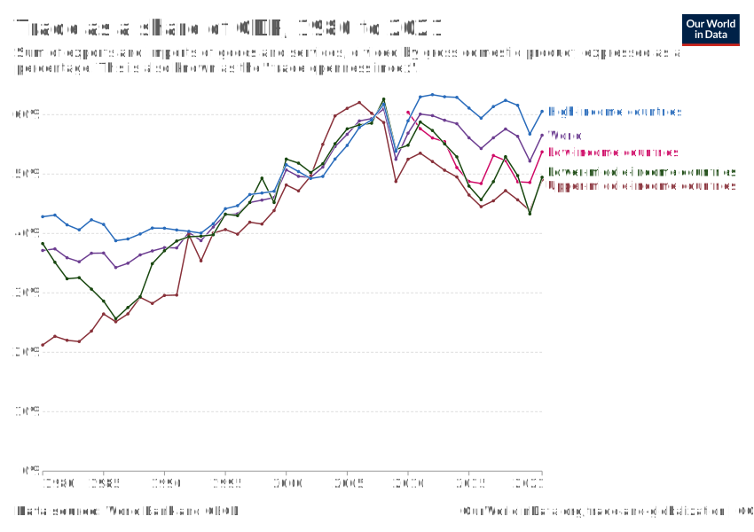 \
*Abbildung 1: Außenhandelsquote*

Notes:
Anteil des Internationalen Handels (Importe + Exporte) als Prozent des BIP
- Außenhandel hat in den letzten Jahrzehnten auf der ganzen Welt an Bedeutung gewonnen
- Globalisierung besonders sichtbar in Entwicklungs- und Schwellenländern
- Strukturbruch seit 2008 (Finanzkrise):
    - In Industrieländern weitgehend stagniert
    - In Entwicklungs- und Schwellenländern sogar rückläufig
Außenhandel erfüllt eine zentrale Rolle bei der wirtschaftlichen Entwicklung:
    - Produktivität steigt durch Spezialisierung
    - Versorgung mit kritischen Gütern robuster gegen lokale Schocks

--

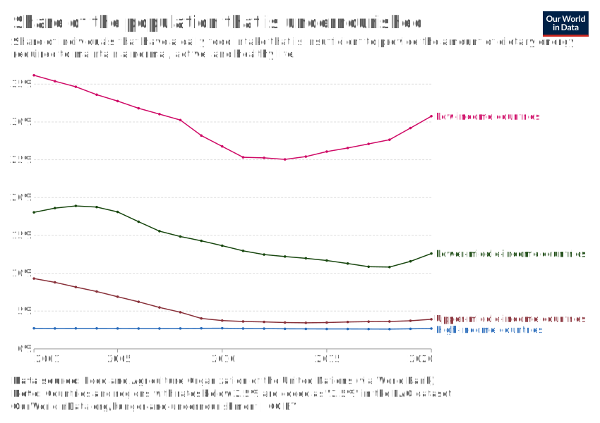 \
*Abbildung 2: Globale Unterernährung*

Notes:
Anteil an der Bevölkerung, der unterernährt ist
- Leider nur Daten ab 2001 verfügbar
- Wenn man sich vergleichbare Daten anschaut, sieht man seit 1980 einen klaren Abwärtstrend
- Erst in den letzten Jahren wächst das Hungerproblem besonders in Entwicklungsländern
- Natürlich hat das viele komplexe Ursachen (politische, ökologische, wirtschaftliche)
- Rückläufiger Außenhandel ist ein wichtiger Aspekt von vielen:
    - Versorgungssicherheit bei lokalen Schocks (leider nicht bei globalen, dazu später mehr)
    - Produktivitätswachstum!

--

|||
|:-:|:-:|
|||
|*Adam Smith (1723-1790)*|*David Ricardo (1772-1823)*|

Notes:
- Im 17. und 18. Jh. war der Merkantilismus die gängige handelspolitische Strategie
- Beide waren Vertreter eines liberaleren Ansatzes
- Adam Smith: Handel nützt beiden Ländern, wenn sie absolute Kostenvorteile besitzen
- David Ricardo: Außenhandel lohnt sich auch dann, wenn ein Land keinen absoluten Effizienzvorteil hat

--

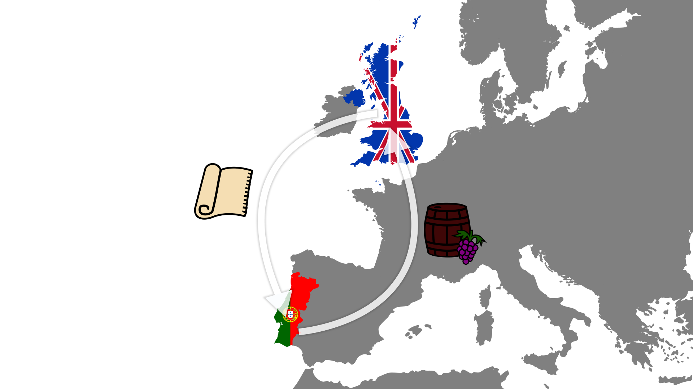 \
*Abbildung 3: Ricardos Außenhandelsmodell*

Notes:
- David Ricardo stellte 1817 eine Theorie auf, die heute als Ricardos Außenhandelsmodell bekannt ist
- Kernidee: Länder sollten sich auf die Produktion von Gütern spezialisieren, bei denen sie einen komparativen Kostenvorteil haben
- Dies führt zu effizienterer Produktion und mehr Wohlstand für alle beteiligten Länder
- Beispiel: Portugal ist effizient in der Produktion von Wein, England in der von Tuch
- Selbst wenn Portugal beide Güter effizienter produzieren kann, profitiert es von Spezialisierung und Handel

--

#### Kosten der Produktion <!-- .element: class="fragment semi-fade-out" data-fragment-index="8" -->

<table class="fragment semi-fade-out" data-fragment-index="8">
    <thead>
        <tr>
        <th></th>
        <th colspan="2" align="center">Absolut (h/t)</th>
        <th colspan="2" align="center">Relativ (t/t)</th>
        </tr>
    </thead>
    <tbody>
        <tr>
            <td></td>
            <td align="center">Wein</td>
            <td align="center">Tuch</td>
            <td align="center" class="fragment" data-fragment-index="1">Wein</td>
            <td align="center" class="fragment" data-fragment-index="1">Tuch</td>
        </tr>
        <tr>
            <td>Portugal</td>
            <td align="center">$80{h \over t}$</td>
            <td align="center">$90{h \over t}$</td>
            <td align="center" class="fragment" data-fragment-index="2">
                
                    $80{h \over t} / 90{h \over t}$
                    $0.889$
                
            </td>
            <td align="center" class="fragment" data-fragment-index="3">
                
                    $90{h \over t} / 80{h \over t}$
                    $1.125$
                
            </td>
        </tr>
        <tr>
            <td>England</td>
            <td align="center">$120{h \over t}$</td>
            <td align="center">$100{h \over t}$</td>
            <td align="center" class="fragment" data-fragment-index="5">
                
                    $120{h \over t} / 100{h \over t}$
                    $1.2$
                
            </td>
            <td align="center" class="fragment" data-fragment-index="6">
                
                    $100{h \over t} / 120{h \over t}$
                    $0.833$
                
            </td>
        </tr>
    </tbody>
</table>

#### Gesamtproduktion <!-- .element: class="fragment" data-fragment-index="8" -->

<table class="fragment" data-fragment-index="8">
    <tr>
        <th></th>
        <th colspan="2" align="center">ohne Handel</th>
        <th colspan="2" align="center">mit Handel</th>
    </tr>
    <tr>
        <th></th>
        <th align="center">Wein</th>
        <th align="center">Tuch</th>
        <th align="center">Wein</th>
        <th align="center">Tuch</th>
    </tr>
    <tr>
        <td>Portugal (170h)</td>
        <td align="center" class="fragment" data-fragment-index="9">$1t$</td>
        <td align="center" class="fragment" data-fragment-index="9">$1t$</td>
        <td align="center" class="fragment" data-fragment-index="11">
            
                $170h / 80{h \over t}$
                $2.125t$
            
        </td>
        <td align="center" class="fragment" data-fragment-index="10">$0t$</td>
    </tr>
    <tr>
        <td>England (220h)</td>
        <td align="center" class="fragment" data-fragment-index="13">$1t$</td>
        <td align="center" class="fragment" data-fragment-index="13">$1t$</td>
        <td align="center" class="fragment" data-fragment-index="14">$0t$</td>
        <td align="center" class="fragment" data-fragment-index="15">
            
                $220h / 100{h \over t}$
                $2.2t$
            
        </td>
    </tr>
    <tr class="fragment" data-fragment-index="17">
        <td>Summe</td>
        <td align="center">$2t$</td>
        <td align="center">$2t$</td>
        <td align="center">$2.125t$</td>
        <td align="center">$2.2t$</td>
    </tr>
</table>

Notes:
- Tabelle: Arbeitsstunden/Tonne für Wein, Tuch; Portugal vs. England.
- Absolute Kosten: Arbeitsstunden pro Tonne Wein/Tuch
- Relative Kosten: Auf wieviele Tonnen Tuch muss ich verzichten, wenn ich eine zusätzliche Tonne Wein produziere
- Komparativer Vorteil: Nicht absolute, sondern relative Kosten entscheidend.
- Beispiel: England sollte Tuch, Portugal Wein produzieren, trotz Portugals absoluter Effizienz in beidem.
- Spezialisierung führt zu größerer Gesamtproduktion
- Fazit: Handel fördert globale Effizienz, Wohlstand durch Nutzung komparativer Vorteile.

--

|||
|:-:|:-:|
|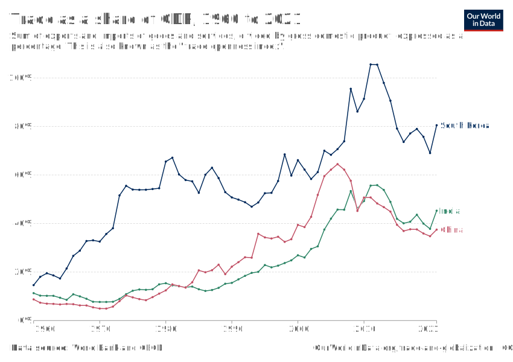|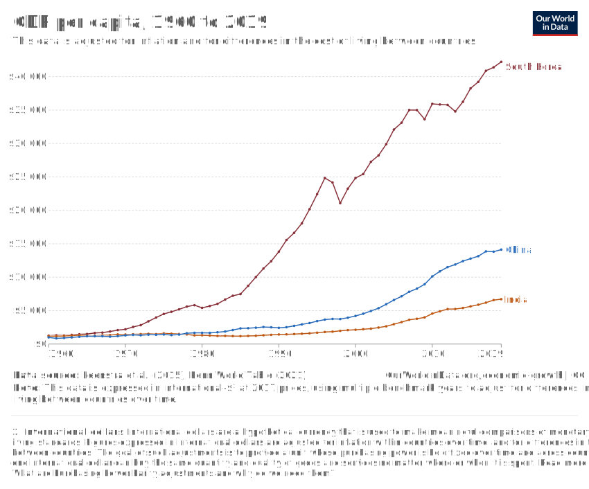|
|*Abbildung 4: Außenhandelsquote in asiatischen Schwellenländern*|*Abbildung 5: BIP pro Kopf in asiatischen Schwellenländern*|

---
<!-- .slide: data-background-image="images/currency-exchange-trade.png" -->
# Finanzmärkte und Wirtschaftliche Entwicklung

--

## Führt finanzielle Globalisierung zu wirtschaftlicher Entwicklung?

--

<svg
   width="800"
   height="600"
   viewBox="0 0 800 600"
   version="1.1"
   id="svg5"
   xmlns="http://www.w3.org/2000/svg"
   xmlns:svg="http://www.w3.org/2000/svg">
  <defs
     id="defs2">
    <marker
       style="overflow:visible;"
       id="Arrow1Mend"
       refX="0.0"
       refY="0.0"
       orient="auto">
      <path
         transform="scale(0.4) rotate(180) translate(10,0)"
         style="fill-rule:evenodd;fill:context-stroke;stroke:context-stroke;stroke-width:1.0pt;fill:#e7e7e7;fill-opacity:1"
         d="M 0.0,0.0 L 5.0,-5.0 L -12.5,0.0 L 5.0,5.0 L 0.0,0.0 z "
         id="path2390" />
    </marker>
    <marker
       style="overflow:visible"
       id="Arrow1Mstart"
       refX="0.0"
       refY="0.0"
       orient="auto">
      <path
         transform="scale(0.4) translate(10,0)"
         style="fill-rule:evenodd;fill:context-stroke;stroke:context-stroke;stroke-width:1.0pt;fill:#e7e7e7;fill-opacity:1"
         d="M 0.0,0.0 L 5.0,-5.0 L -12.5,0.0 L 5.0,5.0 L 0.0,0.0 z "
         id="path2387" />
    </marker>
  </defs>
  <g
     id="layer1">
    <g
       id="axes">
      <text
         xml:space="preserve"
         style="font-style:normal;font-weight:normal;font-size:40px;line-height:1.25;font-family:sans-serif;fill:#e7e7e7;fill-opacity:1;stroke:none"
         x="650"
         y="580"
         id="x_axis_label"><tspan
           id="tspan92897"
           x="650"
           y="580"
           style="fill:#e7e7e7;fill-opacity:1">$</tspan></text>
      <text
         xml:space="preserve"
         style="font-style:normal;font-weight:normal;font-size:40px;line-height:1.25;font-family:sans-serif;fill:#e6e6e6;fill-opacity:1;stroke:none"
         x="25"
         y="60"
         id="y_axis_label"><tspan
           id="tspan66315"
           x="25"
           y="60"
           style="font-style:normal;fill:#e6e6e6;fill-opacity:1">i</tspan></text>
      <path
         style="fill:none;stroke:#cdcdcd;stroke-width:2;stroke-linecap:butt;stroke-linejoin:miter;stroke-miterlimit:4;stroke-dasharray:none;stroke-opacity:1;marker-end:url(#Arrow1Mend)"
         d="M 50,550 H 650"
         id="x_axis" />
      <path
         style="fill:none;stroke:#cdcdcd;stroke-width:2;stroke-linecap:butt;stroke-linejoin:miter;stroke-miterlimit:4;stroke-dasharray:none;stroke-opacity:1;marker-start:url(#Arrow1Mstart)"
         d="M 50,50 V 550"
         id="y_axis" />
    </g>
    <g
       id="savings">
      <path
         style="fill:none;stroke:#5599ff;stroke-width:3;stroke-linecap:butt;stroke-linejoin:miter;stroke-miterlimit:4;stroke-dasharray:none;stroke-opacity:1"
         d="m 524.26914,75 c 0,0 -75,250 -450,450"
         id="s_curve" />
      <text
         xml:space="preserve"
         style="font-style:normal;font-weight:normal;font-size:40px;line-height:1.25;font-family:sans-serif;fill:#5599ff;fill-opacity:1;stroke:none"
         x="530"
         y="80"
         id="s_label"><tspan
           id="tspan19250"
           x="530"
           y="80"
           style="fill:#5599ff;fill-opacity:1">S</tspan></text>
    </g>
    <g
       class="fragment"
       id="investment">
      <path
         style="fill:none;stroke:#ff5555;stroke-width:3;stroke-linecap:butt;stroke-linejoin:miter;stroke-miterlimit:4;stroke-dasharray:none;stroke-opacity:1"
         d="m 75,75 c 0,0 75,250 450,450"
         id="i_curve" />
      <text
         xml:space="preserve"
         style="font-style:normal;font-weight:normal;font-size:40px;line-height:1.25;font-family:sans-serif;fill:#ff5555;fill-opacity:1;stroke:none"
         x="530"
         y="530"
         id="i_label"><tspan
           id="tspan31860"
           x="530"
           y="530"
           style="fill:#ff5555;fill-opacity:1">I</tspan></text>
    </g>
    <g
       class="fragment"
       id="interest_local">
      <path
         style="fill:#e6e6e6;stroke:#e6e6e6;stroke-width:2.5;stroke-linecap:butt;stroke-linejoin:miter;stroke-miterlimit:4;stroke-dasharray:7.5, 7.5;stroke-dashoffset:0;stroke-opacity:1"
         d="m 300,372 c -80,0 -160,0 -250,0"
         id="interest_local_line" />
      <text
         xml:space="preserve"
         style="font-style:normal;font-weight:normal;font-size:40px;line-height:1.25;font-family:sans-serif;fill:#e4e4e4;fill-opacity:1;stroke:none"
         x="14"
         y="385"
         id="interest_local_label"><tspan
           id="tspan58245"
           x="14"
           y="385"
           style="font-style:normal;fill:#e4e4e4;fill-opacity:1">i*</tspan></text>
    </g>
    <g
       class="fragment"
       id="si_amount">
      <path
         style="fill:none;stroke:#e5e5e5;stroke-width:2.5;stroke-linecap:butt;stroke-linejoin:miter;stroke-miterlimit:4;stroke-dasharray:7.5, 7.5;stroke-dashoffset:0;stroke-opacity:1"
         d="M 300,372 V 550"
         id="si_amount_line" />
      <text
         xml:space="preserve"
         style="font-style:normal;font-weight:normal;font-size:40px;line-height:1.25;font-family:sans-serif;fill:#000000;fill-opacity:1;stroke:none"
         x="252.28438"
         y="586.16901"
         id="si_amount_label"><tspan
           id="tspan133486"
           x="252.28438"
           y="586.16901"
           style="font-size:40px;fill:#e6e6e6;fill-opacity:1">S*=I*</tspan></text>
    </g>
    <g
       class="fragment"
       id="world_market">
      <path
         style="fill:none;stroke:#aade87;stroke-width:3;stroke-linecap:butt;stroke-linejoin:miter;stroke-miterlimit:4;stroke-dasharray:none;stroke-dashoffset:0;stroke-opacity:1"
         d="M 75,435 H 575"
         id="a_curve" />
      <text
         xml:space="preserve"
         style="font-style:normal;font-weight:normal;font-size:40px;line-height:1.25;font-family:sans-serif;fill:#aade87;fill-opacity:1;stroke:none"
         x="580"
         y="445"
         id="a_label"><tspan
           id="tspan111731"
           x="580"
           y="445">A</tspan></text>
    </g>
    <text
       class="fragment"
       xml:space="preserve"
       style="font-style:normal;font-weight:normal;font-size:40px;line-height:1.25;font-family:sans-serif;fill:#e4e4e4;fill-opacity:1;stroke:none"
       x="14"
       y="450"
       id="interest_world_label"><tspan
         id="tspan101320"
         x="14"
         y="450"
         style="font-style:normal;fill:#e4e4e4;fill-opacity:1">i'</tspan></text>
    <g
       class="fragment"
       id="s_amount">
      <path
         style="fill:none;stroke:#e5e5e5;stroke-width:2.5;stroke-linecap:butt;stroke-linejoin:miter;stroke-miterlimit:4;stroke-dasharray:7.5, 7.5;stroke-dashoffset:0;stroke-opacity:1"
         d="M 220,435V 550"
         id="s_amount_line" />
      <text
         xml:space="preserve"
         style="font-style:normal;font-weight:normal;font-size:40px;line-height:1.25;font-family:sans-serif;fill:#000000;fill-opacity:1;stroke:none"
         x="204.17531"
         y="586.16901"
         id="s_amount_label"><tspan
           id="tspan152396"
           x="205"
           y="585"
           style="font-size:40px;fill:#e6e6e6;fill-opacity:1">S'</tspan></text>
    </g>
    <g
       class="fragment"
       id="i_amount">
      <path
         style="fill:none;stroke:#e5e5e5;stroke-width:2.5;stroke-linecap:butt;stroke-linejoin:miter;stroke-miterlimit:4;stroke-dasharray:7.5, 7.5;stroke-dashoffset:0;stroke-opacity:1"
         d="M 380,435V 550"
         id="i_amount_line" />
      <text
         xml:space="preserve"
         style="font-style:normal;font-weight:normal;font-size:40px;line-height:1.25;font-family:sans-serif;fill:#000000;fill-opacity:1;stroke:none"
         x="375"
         y="585"
         id="i_amount_label"><tspan
           id="tspan161922"
           x="375"
           y="585"
           style="font-size:40px;fill:#e6e6e6;fill-opacity:1">I'</tspan></text>
    </g>
  </g>
</svg> \
*Abbildung 6: Kapitalmarktgleichgewicht*

--

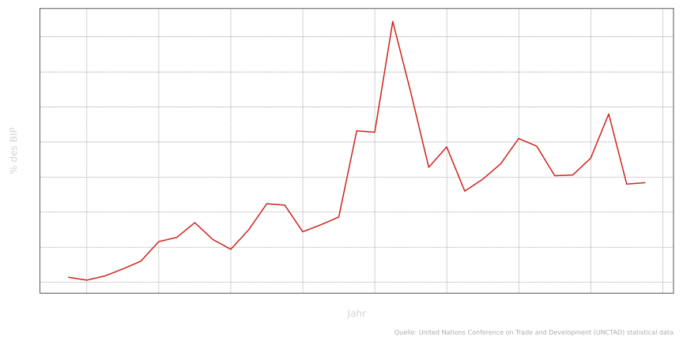 \
*Abbildung 7: Direktinvestitionen in Indien*

--

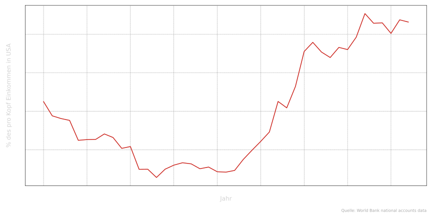 \
*Abbildung 8: Pro-Kopf Einkommen in Indien*

--

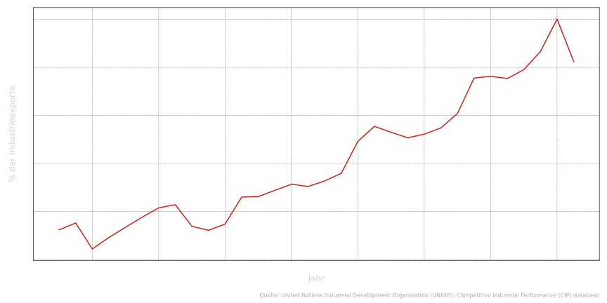 \
*Abbildung 9: Medium- und High-Tech Exporte in Indien*

---

<!-- .slide: data-background-image="images/financial_crises.png" -->
# Wechselkurse, Währungspolitik und Finanzkrisen

--

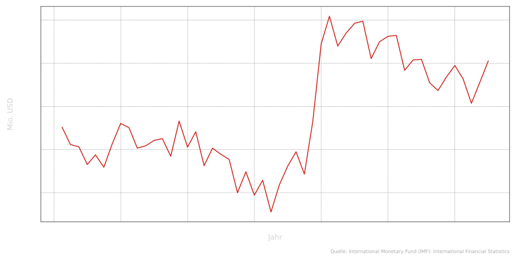 \
*Abbildung 10: Leistungsbilanzsaldo in Thailand*

--

## Kapitalmarkt revisited: Internationale Verschuldung

Notes:
- Nicht alle Investitionen sind langfristige Direktinvestitionen
- Verschuldung spielt eine zentrale Rolle
- Selbst Eigenkapital kann volatil sein

--

 \
*Abbildung 11: Wechselkurse*

Notes:
- Was sind Wechselkurse und warum sind sie wichtig?
- Was passiert bei einer Aufwertung der Währung?
    - Importe werden günstiger, Exporte teurer
    - Gerade für Schwellenländer ist der Exportsektor meist besonders wichtig (warum?)
    - Wirkt oft wachstumshemmend und kann zu Arbeitslosigkeit führen
- Was passiert bei einer Abwertung der Währung?
    - Exporte werden günstiger
    - Kann das Wachstum befördern
    - Importe werden teurer -> Inflation
    - Verschuldung in ausländischer Währung nimmt zu

--

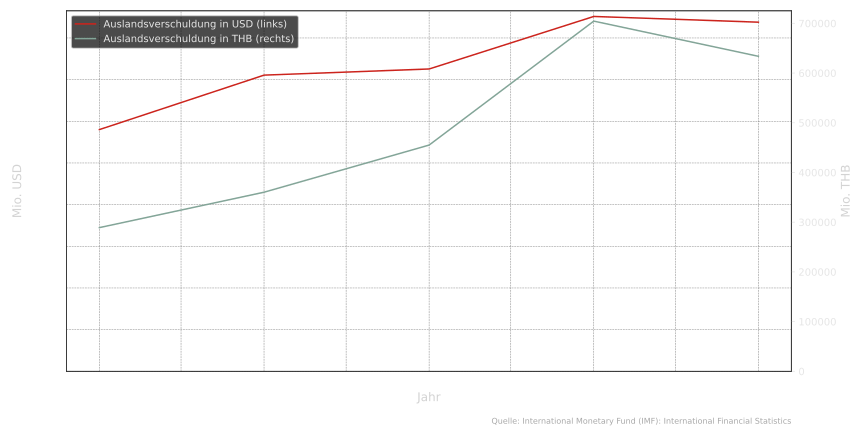 \
*Abbildung 12: Auslandsverschuldung Thailand*

--

## Währungspolitik

&nbsp;

&nbsp;

### Wie kann eine Zentralbank den Wechselkurs beeinflussen? <!-- .element: class="fragment" -->

&nbsp;

&nbsp;

### Gibt es Grenzen? <!-- .element: class="fragment" -->

Notes:
- Zentralbank kann den Wechselkurs beeinflussen. Wie?

--

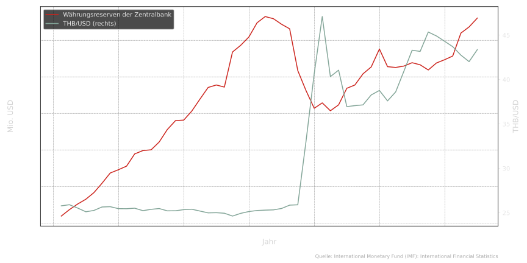 \
*Abbildung 13: Währungsreserven der Thailändischen Zentralbank*

--

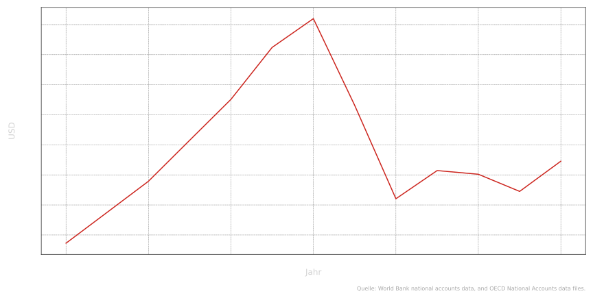 \
*Abbildung 14: Pro Kopf Einkommen in Thailand*

---

# Aktuelle Herausforderungen

---

# Leistungsnachweis

- Essay 1000-1200 Wörter
- Keine Gruppenarbeit (bitte keine identischen Texte abgeben)
- Keine Plagiate
- Informationsquellen insb. bei Daten kenntlich machen
- Wissenschaftliche Fachzeitschriften als Quelle gewünscht
- Datei im .pdf-, .docx- oder .odt-Format abgeben
- Namen und Matrikelnummer angeben
- Wortanzahl vermerken
