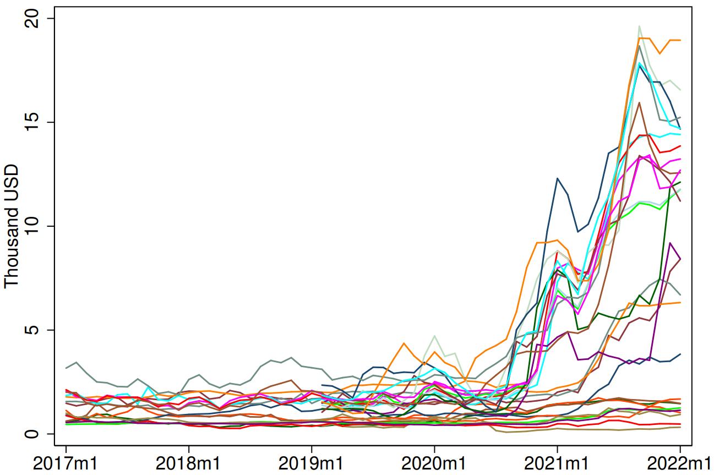

<!-- .slide: data-background-image="images/container-port.jpg" -->
# Internationale Wirtschaftsbeziehungen
## David Joshua Cardoso Herok
### Hochschule Anhalt

---

# Zeitplan

|                 |                                                     |
|:---------------:|:----------------------------------------------------|
| 10:30 - 11:15   | Außenhandel und Wirtschaftliche Entwicklung         |
| 11:15 - 12:00   | Finanzmärkte und Wirtschaftliche Entwicklung        |
| *12:00 - 12:30* | *Pause*                                             |
| 12:30 - 13:15   | Wechselkurse, Währungspolitik und Finanzkrisen      |
| 13:15 - 14:00   | Nachhaltigkeit, Resilienz und Versorgungssicherheit |

Notes:
- In den ersten beiden Teilen erkunden wir, wie Globalisierung zu wirtschaftlicher Entwicklung beiträgt:
    - Teil 1: Außenhandel
    - Teil 2: Internationale Finanzmärkte
- Das liefert uns die nötigen Grundlagen, um nach der Pause eine kritische Perspektive einzunehmen:
    - Teil 3: Herausforderungen durch finanzielle Globalisierung, insb. Finanzkrisen
    - Teil 4: Aktuelle Herausforderungen: Ökologisch, Geopolitisch, Versorgunssicherheit

---
<!-- .slide: data-background-image="images/trading-dock.png" -->
# Außenhandel und Wirtschaftliche Entwicklung

Notes:
- Führt Außenhandel zu wirtschaftlicher Entwicklung?

--

 \
*Abbildung 1: Außenhandelsquote*

Notes:
Anteil des Internationalen Handels (Importe + Exporte) als Prozent des BIP
- Außenhandel hat in den letzten Jahrzehnten auf der ganzen Welt an Bedeutung gewonnen
- Globalisierung besonders sichtbar in Entwicklungs- und Schwellenländern
- Strukturbruch seit 2008 (Finanzkrise):
    - In Industrieländern weitgehend stagniert
    - In Entwicklungs- und Schwellenländern sogar rückläufig

--

 \
*Abbildung 2: Globale Unterernährung*

Notes:
Anteil an der Bevölkerung, der unterernährt ist
- Leider nur Daten ab 2001 verfügbar
- Wenn man sich vergleichbare Daten anschaut (wie z.B. absolute Armutsraten), sieht man seit 1980 einen klaren Abwärtstrend
- Erst in den letzten Jahren wächst das Hungerproblem besonders in Entwicklungsländern
- Natürlich hat das viele komplexe Ursachen (politische, ökologische, wirtschaftliche)
- Außenhandel erfüllt eine zentrale Rolle bei der wirtschaftlichen Entwicklung
- **Wie sieht diese Rolle aus?**
    - Versorgung mit kritischen Gütern robuster gegen lokale Schocks
    - Produktivität steigt durch Spezialisierung
- Um zu verstehen, wie Außenhandel die Produktivität steigert, reisen wir gut 200 Jahre in die Vergangenheit

--

|                                               |                                                  |
| :-:                                           | :-:                                              |
|  |  |
| *Adam Smith (1723-1790)*                      | *David Ricardo (1772-1823)*                      |

Notes:
- Im 17. und 18. Jh. war der Merkantilismus die gängige handelspolitische Strategie
- Merkantilismus:
    - Fokus auf Exporterlöse
    - Anhäufung von Gold z.B. um Kriegskassen zu füllen
    - Interessen der Zivilbevölkerung zweitrangig
- Beide waren Vertreter eines liberaleren Ansatzes
- Adam Smith: Handel nützt beiden Ländern, wenn sie absolute Kostenvorteile besitzen
    - Land A kann Gut 1 günstiger produzieren und Land B kann Gut 2 günstiger produzieren
- David Ricardo: Außenhandel lohnt sich auch dann, wenn ein Land keinen absoluten Effizienzvorteil hat

--

 \
*Abbildung 3: Ricardos Außenhandelsmodell*

Notes:
- David Ricardo stellte 1817 eine Theorie auf, die heute als Ricardos Außenhandelsmodell bekannt ist
- Kernidee: Länder sollten sich auf die Produktion von Gütern spezialisieren, bei denen sie einen komparativen Kostenvorteil haben
- Dies führt zu effizienterer Produktion und mehr Wohlstand für alle beteiligten Länder
- Beispiel: Wein- und Tuchhandel zwischen England und Portugal
- Smith: Handel lohnt sich, wenn Portugal Wein, und England Tuch günstiger produzieren kann
- Ricardo: Selbst wenn Portugal beide Güter effizienter produzieren kann, profitiert es von Spezialisierung und Handel
- In anderen Worten: abgesehen von Transaktions- und Transportkosten lohnt sich Handel eigentlich immer
- Am besten lässt sich das anhand eines einfachen Zahlenbeispiels zeigen.

--

Notes:
- Tabelle: Arbeitsstunden/Tonne für Wein, Tuch; Portugal vs. England.
- Absolute Kosten: Arbeitsstunden pro Tonne Wein/Tuch
- **Welches Land hat den absoluten Kostenvorteil für welches Gut?**
- Relative Kosten: Auf wieviele Tonnen Tuch muss ich verzichten, wenn ich eine zusätzliche Tonne Wein produziere
- Komparativer Vorteil: Nicht absolute, sondern relative Kosten entscheidend.
- Beispiel: England sollte Tuch, Portugal Wein produzieren, trotz Portugals absoluter Effizienz in beidem.
- Spezialisierung führt zu größerer Gesamtproduktion
- Fazit: Handel fördert globale Effizienz, Wohlstand durch Nutzung komparativer Vorteile.
- **Reminder:** Dieses sehr vereinfachende Modell abstrahiert von jeglichen Transaktionskosten des Handels
- Es betrachtet jedoch auch ausschließlich den statischen Produktionsgewinn durch Spezialisierung
- Mittel- und langfristig fallen Produktionsgewinne durch Skaleneffekte, Innovationen und Technologietransfer meist noch wesentlich größer aus.

--

|                                                                  |                                                             |
| :-:                                                              | :-:                                                         |
|                        |                          |
| *Abbildung 4: Außenhandelsquote in asiatischen Schwellenländern* | *Abbildung 5: BIP pro Kopf in asiatischen Schwellenländern* |

Notes:
- Links: Außenhandelsquote in Südkorea, Indien und China seit 1960
- Rechts: Reales BIP pro Kopf (in USD) in Südkorea, Indien und China
- Südkorea: Schon seit den 1960ern und 1970ern stärkerer Fokus auf Außenhandel
- China: seit Ende der 1970er Jahre graduelle Öffnung der Märkte (jedoch nach wie vor streng staatlich kontrolliert)
- Indien: besonders seit den 1990er Jahren Reformprogramme zur Liberalisierung des Außenhandels und der Finanzmärkte (dazu später mehr)
- Alle drei Länder sind gute Beispiele für die wichtige Rolle des Außenhandels bei der wirtschaftlichen Entwicklung
- Seit Mitte der 2000er scheint der Globalisierungstrend gebrochen:
    - Außenhandelsquote kann nicht immer weiter steigen und hängt von vielen Faktoren ab
    - Niedrige globale Zinsen haben zu Aufwertungsdruck und finanzieller Instabilität in Schwellenländern geführt \
    -> Protektionismus wieder *en vogue*

---
<!-- .slide: data-background-image="images/currency-exchange-trade.png" -->
# Finanzmärkte und Wirtschaftliche Entwicklung

--

## Führt finanzielle Globalisierung zu wirtschaftlicher Entwicklung?

Notes:
- Was meinen Sie? Was sind die Kanäle?
- Für langfristige Entwicklung ist die Produktivität entscheidend
- Welchen Einfluss haben globale Finanzströme auf die Produktivität in der Realwirtschaft?

--

*Abbildung 6: Kapitalmarktgleichgewicht*

Notes:
- Vertikal: Zins, horizontal: Ersparnisse und Investitionen (z.B. in $)
- S: Ersparnisse in Abhängigkeit vom Zins
- **Warum steigt S?**
- I: Investitionen in Abhängigkeit vom Zins
- **Warum fällt I?**
- Gleichgewichtszins i* mit Investitionen = Ersparnissen I* = S*
- A: internationaler Finanzmarkt
- **Warum ist A konstant bei einem Zinsniveau i'?**
- Plötzlich haben wir ein Ungleichgewicht: S < I
- **Was würde passieren, wenn A über dem lokalen Gleichgewicht liegen würde?**
- **Warum liegt A unter dem inländischen Gleichgewicht?**
- **Was ist besser? Kapitalzuflüsse oder -abflüsse?**

--

 \
*Abbildung 7: Globale Leistungsbilanzsaldi*

Notes:
- Jedem Kapitalexport steht ein Kapitalimport im Rest der Welt gegenüber
- Länder können aus den verschiedensten Gründen netto Kapital exportieren oder importieren
- **Was bedeutet eigentlich ein Leistungsbilanzdefizit oder -überschuss?**
- **Welche Gründe könnte es geben?**

--

 \
*Abbildung 8: Direktinvestitionen in Indien*

Notes:
- Anteil der Direktinvestitionen am BIP in Indien
- **Direktinvestitionen:** meist langfristige Investitionen, bei denen ein
Unternehmen oder eine Person direkt in ein Unternehmen in einem anderen Land
investiert
- Sieht sehr graduell aus, weil wir einen riesigen Peak in 2009 haben
- Ist aber ein sehr beachtlicher Anstieg schon während der 1990er Jahre
- Anfang der 90er noch fast bei 0
- Seit 1991 Paradigmenwechsel in der indischen Wirtschaftspolitik
- Zuvor sehr protektionistisch und isolationistisch (auch bedingt durch traumatische Erfahrungen aus der Kolonialzeit)
- Seit 1991 starke Liberalisierung der Finanzmärkte und des Außenhandels

--

 \
*Abbildung 9: Pro-Kopf Einkommen in Indien*

Notes:
- Interessante Statistik: Pro Kopf Einkommen relativ zu USA
- Während der 1980er Jahre wirtschaftliche Stagnation und Vergrößerung der Einkommenslücke
- Seit 90ern wieder Wachstum und ein beachtlicher Aufholprozess
- Besonders wenn man das große Bevölkerungswachstum in Indien mitberücksichtigt (pro-Kopf Größen!)
- Öffnung der Finanzmärkte hat aber nicht nur quantitative, sondern auch qualitative Aspekte...

--

 \
*Abbildung 10: Medium- und High-Tech Exporte in Indien*

Notes:
- Anteil der Medium- und High-Tech Exporte an den gesamten Exporten von Industriegütern
- Guter Indikator für langfristige Entwicklung
- Seit Anfang der 1990er Jahre kontinuierlicher Anstieg
- **Welche Rolle könnten die Reformen im Finanzsektor hier gespielt haben?**
- Nicht nur die Öffnung für ausländische Investitionen war hierbei wichtig (Technologietransfer)
- Auch der Zugang der ansässigen kleinen und mittelständischen Unternehmen und
Haushalte zum formalen Bankensektor hat sich stark verbessert.
- **Pause!**

---

<!-- .slide: data-background-image="images/financial_crises.png" -->
# Wechselkurse, Währungspolitik und Finanzkrisen

--

 \
*Abbildung 11: Leistungsbilanzsaldo in Thailand*

Notes:
- Leistungsbilanzsaldo in Thailand in den 1990er und frühen 2000er Jahren
- Leistungsbilanzsaldo: Nettoaußenbeitrag durch Zahlungen für Exporte, Importe, Kapitaleinkommen und laufende Übertragungen
- Negativer Leistungsbilanzsaldo: Land baut Nettoverbindlichkeiten gegenüber dem Ausland auf ("Kapitalzuflüsse")
- Negativer Leistungsbilanzsaldo: Land baut Nettoforderungen gegenüber dem Ausland auf ("Kapitalabflüsse")
- Vor 1998 starke Kapitalzuflüsse, danach eine heftige Umkehr
- **Was kann so eine plötzliche Umkehr von ausländischen Investitionen auslösen?**
- Es hilft, sich das ganze nochmal theoretisch anzusehen

--

*Abbildung 12: Kapitalmarktdynamik*

Notes:
- Ausgangssituation: I > S: Kapitalzuflüsse, Auslandsinvestitionen und Leistungsbilanzdefizit
- Dann steigt der Zins für ausländisches Kapital
- **Was kann so einen Zinsanstieg auslösen?**
- Plötzlich sind die zuvor im Inland getätigten Investitionen nicht mehr rentabel und Kapital wird abgezogen
- S liegt über I
- Vereinfachung: Es können sich natürlich auch die I und S Kurven selbst verschieben, wenn sich die zugrundeliegenden Variablen in der Realwirtschaft ändern
- **Wie schnell wird Kapital abgezogen?**
- Nicht alle Investitionen sind langfristige Direktinvestitionen
- Verschuldung spielt eine zentrale Rolle
- Selbst Eigenkapital kann volatil sein
- Besonders (aber nicht nur) für Verschuldung spielen Wechselkurse eine zentrale Bedeutung

--

 \
*Abbildung 13: Wechselkurse*

Notes:
- Was sind Wechselkurse und warum sind sie wichtig?
- Was passiert bei einer Aufwertung der Währung?
    - Importe werden günstiger, Exporte teurer
    - Gerade für Schwellenländer ist der Exportsektor meist besonders wichtig (warum?)
    - Wirkt oft wachstumshemmend und kann zu Arbeitslosigkeit führen
- Was passiert bei einer Abwertung der Währung?
    - Exporte werden günstiger
    - Kann das Wachstum befördern
    - Importe werden teurer -> Inflation
    - Verschuldung in ausländischer Währung nimmt zu

--

 \
*Abbildung 14: Auslandsverschuldung Thailand*

Notes:
- Auslandsverschuldung aus Sicht des Weltmarkts (rot)
- und aus Sicht der Unternehmen und Haushalte in Thailand (blau)
- In Thai Baht ist die Auslandsverschuldung innerhalb eines Jahres um fast 60% gestiegen
- Spekulative Attacken auf den Thai Baht spielten eine entscheidende Rolle
- Kann der Staat etwas gegen Wechselkursschwankungen machen?

--

## Währungspolitik

&nbsp;

&nbsp;

### Wie kann eine Zentralbank den Wechselkurs beeinflussen? <!-- .element: class="fragment" -->

&nbsp;

&nbsp;

### Gibt es Grenzen? <!-- .element: class="fragment" -->

Notes:
- Zentralbank kann den Wechselkurs beeinflussen. Wie?
- **Stabilisierung bei Aufwertungsdruck?**
- **Stabilisierung bei Abwertungsdruck?**
- Wie lange geht das gut?

--

 \
*Abbildung 15: Währungsreserven der Thailändischen Zentralbank*

Notes:
- Rot: Währungsreserven der thailändischen Zentralbank
- Blau: Wechselkurs Thai Baht
- **Was bedeutet eine Anstieg der blauen Kurve hier?**
- Reserven sind kontinuierlich angestiegen
- **Was hat die Zentralbank in der ersten Hälfte der 1990er gemacht?**
- **Was ist danach passiert?**

--

 \
*Abbildung 16: Pro Kopf Einkommen in Thailand*

Notes:
- **Welche Auswirkungen hat das ganze auf die Realwirtschaft?**
- Kredite in USD konnten nicht mehr bedient werden
- Finanzierung für viele Investitionsprojekte konnte nicht mehr aufrechterhalten werden
- Aus der Finanzkrise wurde eine reale Wirtschaftskrise
- Pro Kopf Einkommen (in USD) um 40% gesunken und nur sehr graduelle Erholung

---

<!-- .slide: data-background-image="images/fragility.png" -->
# Nachhaltigkeit, Resilienz und Versorgungssicherheit

Notes:
- Im letzten Teil soll es um aktuelle Herausforderungen gehen
- Wir leben in einer stark globalisierten Welt
- Die Globalisierung hat Milliarden von Menschen aus der Armut geholfen
- Internationale Wirtschaftsbeziehungen haben auch weiterhin das Potenzial, globale Herausforderungen zu lösen
- Der Klimawandel ist jedoch nur ein Indikator, dass wir nicht weitermachen können wie bisher
- Die globale Wirtschaftsordnung ist fragil, wie wir zuletzt durch die Covid-19 Pandemie und die aktuellen geopolitischen Herausforderungen gesehen haben
- Wo geht die Reise hin und wie kann ein nachhaltiges und resilientes Wirtschaftssystem geschaffen werden
- Welche Zielkonflikte gibt es?
- Keine Patentlösungen. Ich möchte zum Denken und Diskutieren anregen

--

## Globale Lieferketten während Covid-19

 \
*Abbildung 17: Global beobachtete 40ft² Container-Transportkosten (Quelle: BIZ)*

Notes:
- **Was waren die Ursachen für die massiven Unterbrechungen der globalen Lieferketten?**
- Lockdowns allein können das Ausmaß nicht erklären
- Stichwort Spezialisierung: steigert die Produktivität, führt aber auch zu einer starken Fragmentierung der Wertschöpfungsketten
- Mit steigender Spezialisierung steigt auch die Abhängigkeit von jedem einzelnen Glied in der Kette
- **Welche Lehren kann man daraus ziehen?**
    - Größere Sicherheitsbestände in der Lagerhaltung
    - Größere Diversifizierung
    - Stärkung lokaler Lieferketten

--

## Klimawandel und Energiewende

 \
*Abbildung 18: Weltweite CO2-Emmissionen*

Notes:
- Abbildung: Globale CO2-Emmissionen
- **Was sind die Effekte von Globalisierung auf den Klimawandel?**
- Erhöhte CO2-Emmissionen durch Transport
- Aber auch durch Wirtschaftswachstum selbst: wir erreichen jetzt erst langsam
global einen Punkt an dem zusätzlicher Wohlstand nicht notwendigerweise mit
größeren CO2-Emmissionen einhergeht
- **Was sind die Effekte des Klimawandels auf die Weltwirtschaft?**
- Mehr Naturkatastrophen
- Möglicherweise Gefährdung der Versorgunssicherheit und Armut (zumindest regional)
- Aktuelles Beispiel: Geringe Wassertiefe im Panama-Kanal (El Nino)
- **Was bedeutet die Energiewende für die Weltwirtschaft?**
- Alte Rohstoffabhängigkeiten werden durch neue abgelöst (Z.B. Lithium und Kupfer statt Kohle und Erdöl)
- No-Growth-Diskussion ist meiner Meinung nach häufig sehr einseitig
- Globalisierung und wirtschaftliche Entwicklung haben milliarden von Menschen aus der Armut gehoben
- Dennoch: Wirtschaftswachstum ist kein Selbstzweck
- Good News: Nachhaltiges Wachstum ist möglich, aber wir müssen wahrscheinlich unsere Erwartungen dämpfen

--

## Alte und neue Abhängigkeiten

 \
*Abbildung 19: Rohstoffpreise*

Notes:
- Die Abhängigkeit von einigen (häufig politisch instabilen) ölexportierenden Ländern hat schon in der Vergangenheit oft für Konflikte gesorgt
- Energiewende: Abhängigkeit von neuen Ressourcen (z. B. Kupfer, Lithium, seltene Erden, Kobalt)
- Diese Ressourcen sind häufig noch stärker geographisch konzentriert
- Abhängigkeit von China:
    - 70% der seltenen Erden
    - Großer Anteil der Lithium und Kobaltvorkommen und Weiterverarbeitungsindustrie
- Wir sind immer noch nicht von unseren alten Abhängigkeiten frei, wie der Effekt des Russland-Ukraine-Kriegs auf die Preise von Öl und Kohle zeigt

--

<!-- .slide: data-background-image="images/healing_world.png" -->
## Wie kann ein nachhaltiges Wirtschaftssystem gestaltet werden?

Notes:
- **Was ist ein nachhaltiges Wirtschaftssystem?**
    - Klimaschutz?
    - Versorgungssicherheit?
    - Armutsbekämpfung?
- **Welche Rolle spielt Handel?**
    - Größere Diversifizierung und Inklusion von mehr Handelspartnern (z.B. Afrika)
    - Hedging gegen regionale Versorgungsengpässe
- **Welche Rolle spielen Finanzmärkte?**
    - Versicherungen zugägnglicher machen
    - Katastrophenanleihen (sog. Cat Bonds)
    - Rohstoff- und Nahrungsmittelhandel an Finanzmärkten kann regionale Volatilität dämpfen
- **In welche Richtung bewegen wir uns gerade?**
    - Geopolitische Spannungen neben Klimawandel die größte aktuelle Herausforderung
    - Dennoch steigende internationale Kooperation auf anderen Ebenen (z.B. Klima-Commitments)
    - "Coopetition": Intensive Rivalität mit intensiver Diplomatie (z.B. USA und China)

---

# Leistungsnachweis

--

## Anforderungen

- Essay 1000-1200 Wörter
- Keine Gruppenarbeit (bitte keine identischen Texte abgeben)
- Keine Plagiate
- Informationsquellen insb. bei Daten kenntlich machen
- Wissenschaftliche Fachzeitschriften als Quelle gewünscht
- Datei im .pdf-, .docx- oder .odt-Format abgeben
- Namen und Matrikelnummer angeben
- Wortanzahl vermerken
- Abgabe bis 14.07.2024 über Moodle

--

## Themenvorschläge

#### Die Zukunft der Globalisierung in einer post-pandemischen Welt
#### Der Einfluss von Handelskriegen auf die globale Wirtschaftsordnung
#### Klimawandel und wirtschaftliche Entwicklung
#### Die Rolle digitaler Technologien in der modernen Globalisierung
#### Einkommensungleichheit im Zeitalter der Globalisierung
#### Der Ressourcenfluch: Warum sind rohstoffreiche Länder oft arm?
#### Die Rolle internationaler Organisationen in der globalen Wirtschaft

Notes:
- Denken Sie sich gern ein eigenes Thema aus und schicken Sie es mir per E-Mail
- Solange es zur Vorlesung passt, kein Problem
